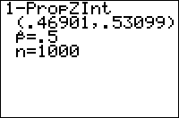

           
|Command Summary|Command Syntax|[Calculator Compatibility](compatibility.html)|[Token Size](tokens.html)|
|--- |--- |--- |--- |
|Computes a Z confidence interval of a proportion.|1-PropZInt(*x*, *n*[, *confidence level*])|TI-83/84/+/SE|2 bytes|

### Menu Location
When editing a program, press:
1. STAT to access the statistics menu
1. LEFT to access the TESTS submenu
1. ALPHA A to select 1-PropZInt(, or use arrows

(this key sequence will give you the 1-PropZInt... screen outside a program)
       
# The 1-PropZInt( Command

The 1-PropZInt( command calculates a confidence interval for a proportion, at a specific confidence level: for example, if the confidence level is 95%, you are 95% certain that the proportion lies within the interval you get. The command assumes that the sample is large enough that the normal approximation to binomial distributions is valid: this is true if, in the sample you take, the positive and negative counts are both >5.

The 1-PropZInt( command takes 3 arguments. The first, *x*, is the positive count in the sample. The second, *n*, is the total size of the sample. (So the sample proportion is equal to *x* out of *n*). The third argument is the confidence level, which defaults to 95.

The output gives you a confidence interval of the form (a,b), meaning that the true proportion π is most likely in the range a<π<b, and the value of *x**/n*.

## Sample Problem

You want to know the proportion of students at your school that support a particular political candidate. You take a random sample of 50 students, and find that 22 of them support that candidate. 22, the positive count, and 50-22=28, the negative count, are both >5, so the assumption is satisfied.

Using 22 for *x*, and 50 for *n*, you decide to find a 95% confidence interval. The syntax for that is:
```
:1-PropZInt(22,50,95
which can also be
:1-PropZInt(22,50,.95
```
The output if you run the above code will look approximately like this:
```
1-PropZInt
 (.30241,.57759)
 p=.44
 n=50
```
This tells you that between about 30.2% and about 57.8% of the students at your school are in support of the political candidate.

## Optimization

If the confidence level is 95%, you can omit the final 95, since that is the default value:

```
:1-PropZInt(22,50,95
can be
:1-PropZInt(22,50
```

## Error Conditions

- **[ERR:DOMAIN](errors.html#domain)** is thrown if the sample proportion is not between 0 and 1, any argument is negative, or the confidence level is 100 or more.

## Related Commands

- [2-PropZInt(](2-propzint.html)
- [ZInterval](zinterval.html)
- [2-SampZInt(](2-sampzint.html)
