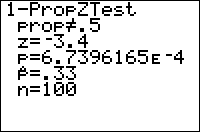

           
|Command Summary|Command Syntax|[Calculator Compatibility](compatibility.html)|[Token Size](tokens.html)|
|--- |--- |--- |--- |
|Performs a *z*-test on a proportion.|1-PropZTest(*p<sub>0</sub>*, *x*, *n*[, *alternative*, *draw?*] )|TI-83/84/+/SE|2 bytes|

### Menu Location
While editing a program, press:
1. STAT to access the statistics menu
2. LEFT to access the TESTS submenu
3. 5 to select 1-PropZTest, or use arrows
(outside the program editor, this will select the 1-PropZTest... interactive solver)
       
# The 1-PropZTest( Command

1-PropZTest performs an *z*-test to compare a population proportion to a hypothesis value. This test is valid for sufficiently large samples: only when the number of successes (*x* in the command syntax) and the number of failures (*n*-*x*) are both >5.

The logic behind the test is as follows: we want to test the hypothesis that the true proportion is equal to some value *p<sub>0</sub>* (the null hypothesis). To do this, we assume that this "null hypothesis" is true, and calculate the probability that the (usually, somewhat different) actual proportion occurred, under this assumption. If this probability is sufficiently low (usually, 5% is the cutoff point), we conclude that since it's so unlikely that the data could have occurred under the null hypothesis, the null hypothesis must be false, and therefore the true proportion is not equal to *p<sub>0</sub>*. If, on the other hand, the probability is not too low, we conclude that the data may well have occurred under the null hypothesis, and therefore there's no reason to reject it.

Commonly used notation has the letter π being used for the true population proportion (making the null hypothesis be π=p<sub>0</sub>). TI must have been afraid that this would be confused with the real number π, so on the calculator, "prop" is used everywhere instead.

In addition to the null hypothesis, we must have an alternative hypothesis as well - usually this is simply that the proportion is not equal to *p<sub>0</sub>*. However, in certain cases, our alternative hypothesis may be that the proportion is greater or less than *p<sub>0</sub>*.

The arguments to 1-PropZTest( are as follows:
- *p<sub>0</sub>* - the value for the null hypothesis (the proportion you're testing for)
- *x* - the success count in the sample
- *n* - the total size of the sample (so the sample proportion would be *x**/n*)
- *alternative* (optional if you don't include *draw?*) - determines the alternative hypothesis
 - 0 (default value) - prop≠p<sub>0</sub>
 - -1 (or any negative value) - prop<p<sub>0</sub>
 - 1 (or any positive value) - prop>p<sub>0</sub>
- *draw?* (optional) set this to 1 if you want a graphical rather than numeric result

Although you can access the 1-PropZTest command on the home screen, via the catalog, there's no need: the 1-PropZTest... interactive solver, found in the statistics menu, is much more intuitive to use - you don't have to memorize the syntax.

In either case, it's important to understand the output of 1-PropZTest. Here are the meanings of each line:

- The first line, involving "prop" and *p<sub>0</sub>*, is the alternative hypothesis.
- z is the test statistic. If the null hypothesis is true, it should be close to 0.
- p is the probability that the difference between the proportion and *p<sub>0</sub>* would occur if the null hypothesis is true. When the value is sufficiently small, we reject the null hypothesis and conclude that the alternative hypothesis is true. You should have a cutoff value ready, such as 5% or 1%. If p is lower, you "reject the null hypothesis on a 5% (or 1%) level" in technical terms.
- p-hat is the sample proportion, *x**/n*.
- n is the sample size.

## Advanced Uses

The final optional argument of 1-PropZTest, *draw?*, will display the results in a graphical manner if you put in "1" for it. The calculator will draw the standard normal distribution, and shade the area of the graph that corresponds to the probability p. In addition, the value of z and the value of p will be displayed. You would make your conclusions in the same way as for the regular output.

## Optimization

Some of the arguments of the 1-PropZTest command have default values, and the argument can be omitted if this value is used.

- The *draw?* argument can be omitted if you don't want graphical output, although you could put "0" in as well.
- If the above argument is omitted, and you're doing a two sided test, you may omit the *alternative* argument.

Example:
```
:1-PropZTest(.5,22,50,0,0
can be
:1-PropZTest(.5,22,50
```

## Error Conditions

- **[ERR:DOMAIN](errors.html#domain)** is thrown if *p<sub>0</sub>* or *x**/n* are not between 0 and 1, or *x* is negative or greater than *n* (however, any real value for *alternative* and *draw?* will work) 

## Related Commands

- [2-PropZTest(](2-propztest.html)
- [Z-Test(](z-test.html)
- [2-SampZTest(](2-sampztest.html)
