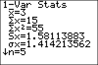

           
|Command Summary|Command Syntax|[Calculator Compatibility](compatibility.html)|[Token Size](tokens.html)|
|--- |--- |--- |--- |
|Calculates some statistics for a single list of data, and stores them to statistical variables. They're also displayed in a scrollable list, if done outside a program.|1-Var Stats [*list*, [*freqlist*]]|TI-83/84/+/SE|1 byte|

### Menu Location
Press:
1. STAT to access the statistics menu
1. LEFT to access the CALC submenu
1. 1 or ENTER to select 1-Var Stats
       
# The 1-Var Stats Command

This command calculates a bunch of common (and a few uncommon) statistics for a [list](lists.html) (it uses L1 by default, but you can use any list by supplying it as an argument). You have to store the list to a variable first, though, before calculating statistics for it. For example:

```
:{5,12,7,8,4,9→L1
:1-Var Stats
```

Like other statistical commands, you can use a frequency list as well, for cases where one element occurs more times than another (you can do this with a normal list, too, but that might be inconvenient when an element occurs very many times). For example:

```
:{1,2,3→L1
:{5,3,2→L2
:1-Var Stats L1,L2
```
is the frequency-list equivalent of:
```
:{1,1,1,1,1,2,2,2,3,3→L1
:1-Var Stats
```

When you're running it from the home screen, 1-Var Stats will display the statistics; this won't happen if you do it inside a program. Either way, it will also store what it calculated to the statistics variables found in VARS>Statistics... The variables 1-Var Stats affects are:
- $\overline{\textrm{x}}$ is the mean (average) of the elements, as returned by [mean(](mean.html)
- Σx is the sum of the elements, as returned by [sum(](sum.html)
- Σx² is the sum of the squares of the elements
- Sx is the sample standard deviation, as returned by [stdDev(](stddev.html)
- σx is population standard deviation
- n is the number of elements in the list, as returned by [dim(](dim.html)
- minX is the minimum value, as returned by [min(](min.html)
- Q1 is the first quartile
- Med is the median, as returned by [median(](median.html)
- Q3 is the third quartile
- maxX is the maximum value, as returned by [max(](max.html)

1-Var Stats will not work with "reserved" list names that the calculator uses internally. The only known such reserved list is the list RESID, and there's no reason to suspect there are any others. Ans, TblInput, and any expression which resolves to a list, are also not appropriate for this command: store all of these to a list before doing 1-Var Stats on them.

## Optimization

Aside from statistical analysis, 1-Var Stats can also be used when you want to use the values it calculates more than once. This will save on size, since, for example Σx takes up less space than sum(L1), but considering how many calculations 1-Var Stats makes, it will usually be slower. Here's a short example which saves 1 byte:

```
:Disp "RANGE:",max(L1)-min(L1
can be
:1-Var Stats
:Disp "RANGE:",maxX-minX
```

## Related Commands

- [2-Var Stats](2-var-stats.html)
