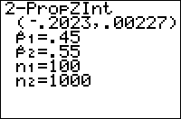

           
|Command Summary|Command Syntax|[Calculator Compatibility](compatibility.html)|[Token Size](tokens.html)|
|--- |--- |--- |--- |
|Computes a Z confidence interval of the difference between two proportions.|2-PropZInt(*x<sub>1</sub>*, *n<sub>1</sub>*, *x<sub>2</sub>*, *n<sub>2</sub>*, [*confidence level*]|TI-83/84/+/SE|2 bytes|

### Menu Location
When editing a program, press:
1. STAT to access the statistics menu
1. LEFT to access the TESTS submenu
1. ALPHA B to select 2-PropZInt(, or use arrows

(this key sequence will give you the 2-PropZInt... screen outside a program)
       
# The 2-PropZInt( Command

The 2-PropZInt( command calculates a confidence interval for the difference between two proportions, at a specific confidence level: for example, if the confidence level is 95%, you are 95% certain that the difference lies within the interval you get. The command assumes that the sample is large enough that the normal approximation to binomial distributions is valid: this is true if, in both samples involved, the positive and negative counts are both >5.

The 1-PropZInt( command takes 5 arguments. The first two, *x<sub>1</sub>* and *n<sub>1</sub>* are the positive count and total count in the first sample (so the estimated value of the first proportion is *x<sub>1</sub>* out of *n<sub>1</sub>*. The next two arguments, *x<sub>2</sub>* and *n<sub>2</sub>*, are the positive count and total count in the second sample.

The output gives you a confidence interval of the form (a,b), which is the range of values for the difference π<sub>1</sub>-π<sub>2</sub> (where π<sub>1</sub> and π<sub>2</sub> are the first and second proportions respectively). If you were looking for the difference π<sub>2</sub>-π<sub>1</sub> all you have to do is switch two sides and negate the numbers in the interval.

## Sample Problem

You want to compare the proportion of students at your school and at a friend's school. that support a particular political candidate. You take a random sample of 50 students, and find that 22 of them support that candidate. Your friend took a random sample of 75 students at his school, and found that 28 supported the candidate.

The first proportion is the proportion of supporters at your school. 22 out of 50 students support the candidate, so *x<sub>1</sub>*=22 and *n<sub>1</sub>*=50. 
The second proportion is the proportion of supporters at your friend's school. 28 out of 75 students support the candidate, so *x<sub>2</sub>*=28 and *n<sub>2</sub>*=75.
If you decided to do a 95% confidence interval, you would add the argument 95 after all these, so the syntax would be as follows: 
```
:2-PropZInt(22,50,28,75,95
which can also be
:2-PropZInt(22,50,28,75,.95
```
The output if you run the above code will look approximately like this:
```
1-PropZInt
 (-.1092,.24249)
 p1=.44
 p2=.3733333333
 n1=50
 n2=75
```
This tells you that between about the difference betwen the proportions is between about -0.11 (your school's proportion being about 0.11 less than your friend's school's proportion) to about 0.24 (your school's proportion being about 0.24 greater than your friend's school's proportion).

## Optimization

If the confidence level is 95%, you can omit the final 95, since that is the default value:

```
:2-PropZInt(22,50,28,75,95
can be
:2-PropZInt(22,50,28,75
```

## Error Conditions

- **[ERR:DOMAIN](errors.html#domain)** is thrown if either proportion is not between 0 and 1, or *x<sub>i</sub>* is negative or greater than *n<sub>i</sub>*, or the confidence level is negative or at least 100.

## Related Commands

- [1-PropZInt(](1-propzint.html)
- [ZInterval](zinterval.html)
- [2-SampZInt(](2-sampzint.html)
