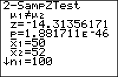

           
|Command Summary|Command Syntax|[Calculator Compatibility](compatibility.html)|[Token Size](tokens.html)|
|--- |--- |--- |--- |
|Performs a *z* significance test to compare the means of two populations.|2-SampZTest(*σ<sub>1</sub>*, *σ<sub>2</sub>* [*list1*, *list2*, *frequency1*, *frequency2*, *alternative*, *draw?*]<br>(data list input)<br><br>2-SampZTest(*σ<sub>1</sub>*, *σ<sub>2</sub>* *x<sub>1</sub>*, *n<sub>1</sub>*, *x<sub>2</sub>*, *n<sub>2</sub>*, [*alternative*, *draw?*]<br>(summary stats input)|TI-83/84/+/SE|2 bytes|

### Menu Location
While editing a program, press:
1. STAT to access the statistics menu
2. LEFT to access the TESTS submenu
3. 3 to select 2-SampZTest(, or use arrows
(outside the program editor, this will select the 2-SampZTest... interactive solver)
       
# The 2-SampZTest( Command

2-SampZTest( performs a *z* significance test to compare the means of two populations. This test is valid for simple random samples from populations with known standard deviations. In addition, either the populations must be normally distributed, or the sample sizes have to be sufficiently large (usually, greater than 10).

The logic behind the test is as follows: we want to test the hypothesis that the true means of the two populations are equal (the null hypothesis). The letter μ is used for a population mean, so this is usually written as μ<sub>1</sub>=μ<sub>2</sub>. To do this, we assume that this "null hypothesis" is true, and calculate the probability that the difference between the two means occurred, under this assumption. If this probability is sufficiently low (usually, 5% is the cutoff point), we conclude that since it's so unlikely that the data could have occurred under the null hypothesis, the null hypothesis must be false, and therefore the means are not equal. If, on the other hand, the probability is not too low, we conclude that the data may well have occurred under the null hypothesis, and therefore there's no reason to reject it.

In addition to the null hypothesis, we must have an alternative hypothesis as well - usually this is simply that the two means are not equal. However, in certain cases when we have reason to suspect that one mean is greater than the other (such as when we are trying to verify a claim that one mean is greater), our alternative hypothesis may be that the first mean is greater than the second (μ<sub>1</sub>>μ<sub>2</sub>) or less (μ<sub>1</sub><μ<sub>2</sub>).

As for the 2-SampZTest( command itself, there are two ways of calling it: after giving the two standard deviations, you may give it a list of all the sample data, or the necessary statistics about the list (*x<sub>1</sub>* and *x<sub>2</sub>* are the sample means, and *n<sub>1</sub>* and *n<sub>2</sub>* are the sample sizes). In either case, you can indicate what the alternate hypothesis is, by a value of 0, -1, or 1 for the *alternative* argument. 0 indicates a two-sided hypothesis of *μ<sub>1</sub>*≠*μ<sub>2</sub>*, -1 indicates *μ<sub>1</sub>*<*μ<sub>2</sub>*, and 1 indicates *μ<sub>1</sub>*>*μ<sub>2</sub>*. (In fact, the calculator will treat any negative value as -1, and any positive value as 1).

Although you can access the 2-SampZTest( command on the home screen, via the catalog, there's no need: the 2-SampZTest... interactive solver, found in the statistics menu, is much more intuitive to use - you don't have to memorize the syntax.

In either case, it's important to understand the output of 2-SampZTest. Here are the meanings of each line:

- The first line, involving μ<sub>1</sub> and μ<sub>2</sub>, is the alternative hypothesis.
- z is the test statistic, the standardized difference between the means. If the null hypothesis is true, it should be close to 0.
- p is the probability that the difference between μ<sub>1</sub> and μ<sub>2</sub> (the two means) would occur if the null hypothesis is true. When the value is sufficiently small, we reject the null hypothesis and conclude that the alternative hypothesis is true. You should have a cutoff value ready, such as 5% or 1%. If p is lower, you "reject the null hypothesis on a 5% (or 1%) level" in technical terms.
- x-bar<sub>1</sub> and x-bar<sub>2</sub> are the two sample means.
- n<sub>1</sub> and n<sub>2</sub> are the sample sizes.

## Sample Problem

Your school claims that the average SAT score of students at the school is higher than at a rival school. You took samples of SAT scores from students at both schools (and stored them to L1 and L2). Although you didn't know the standard deviations, you decided to use the value 200 that you found online as an estimate.

You now have all the data. You're assuming *σ<sub>1</sub>* and *σ<sub>2</sub>* are both 200; the two data lists are L1 and L2. Since the school's claim is that your school's score is higher, that will be your alternative hypothesis (*μ<sub>1</sub>*>*μ<sub>2</sub>*), which corresponds to a value of 1. The code you'd use is:
```
:2-SampZTest(200,200,L1,L2,1
```

Alternatively, you could calculate the mean and sample size of your sample, and put those into the command instead. Suppose you obtained SAT scores from 60 students at your school and 40 students at the rival school, and that the means were 1737 and 1623. Then your code is:
```
:2-SampZTest(200,200,1737,60,1623,40,1
```

You will see the following output:
```
Z-Test
 μ1>μ2
 z=2.792418307
 p=.0026158434
 x1=1737
 x2=1623
 n1=60
 n2=40
```

The most important part of this output is "p=.0026158434". This value of p is much smaller than 1% or 0.01. This is significant on the 1% level, so we reject the null hypothesis and conclude that the alternative hypothesis is true: μ<sub>1</sub>>μ<sub>2</sub>, that is, your school's average SAT score is indeed higher.

## Advanced Uses

The final argument of 2-SampZTest(, *draw?*, will display the results in a graphical manner if you put in "1" for it. The calculator will draw the **standard** normal curve, and shade the area of the graph beyond the z statistic. In addition, the value of z and the value of p will be displayed (the value of p corresponds to the shaded area). You would make your conclusions in the same way as for the regular output.

As with most other statistical commands, you may use a frequency list in your input (when using the data list syntax). If you do, then both lists must have frequencies, and the order of the arguments would be *list1*, *list2*, *frequency1*, *frequency2*.

## Optimization

Most of the arguments of the 2-SampZTest( command have default values, and the argument can be omitted if this value is accepted.

- The *draw?* argument can be omitted if you don't want graphical output, although you could put "0" in as well.
- If the *draw?* argument is omitted, you can omit the *alternative* argument to use a two-sided test (*μ<sub>1</sub>*≠*μ<sub>2</sub>*). If you include the *draw?* argument, you have to include this - otherwise there will be confusion as to what the 5th argument means.
- With data list input, you can always omit the frequency lists if you won't be using them.
- With data list input, if the *draw?* and *alternative* arguments are omitted, and your data is in L1 and L2 (and you're not using frequency lists), you may omit L1 and L2 - those are default parameters. However, if *alternative* or *draw?* is present, you have to include it, or else the syntax may be confused with the syntax for summary stats input.

The code in the sample problem above can't be optimized, because the *alternative* argument is 1:
```
:2-SampZTest(200,200,L1,L2,1
```

However, if we were doing a two-sided test, we could omit the *alternative* argument as well as the lists:
```
:2-SampZTest(200,200,L1,L2,0
can be
:2-SampZTest(200,200
```

## Related Commands

- [Z-Test(](z-test.html)
- [T-Test](t-test.html)
- [2-SampTTest](2-sampttest.html)
