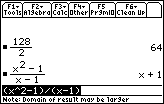

       
|Command Summary|Command Syntax|[Calculator Compatibility](68k:cross-compatibility.html)|[Token Size](6k:tokenization.html)|
|--- |--- |--- |--- |
|Divides one number by another.|value1 / value2|This command works on all calculators.|1 byte|
       
### Menu Location
Press the [/] key to paste /.
       
# The / Command


The / operator divides two numbers, variables, or expressions. It  has higher priority than [+](68k:add.html) and [-](68k:subtract.html), so it will be done before them; it has the same priority as [*](68k:multiply.html).

```
:x/y
		x/y
:2/2
		1
```

Though division by zero isn't allowed, it will not cause an error; instead it returns the value undef — short for "undefined." Dividing by a variable that hasn't been defined yet will cancel it if it occurs on both sides: 5*x/x will equal 5; a short warning will be given to the effect that this isn't valid for x=0.

## Related Commands
- [-](68k:subtract.html) (subtract)
- [*](68k:multiply.html) (multiply)
- [+](68k:add.html) (add)

## See Also

- [68k:Order of Operations](68k:order-of-operations.html)
