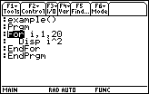

       
|Command Summary|Command Syntax|[Calculator Compatibility](68k:cross-compatibility.html)|[Token Size](6k:tokenization.html)|
|--- |--- |--- |--- |
|Repeats a block of code some number of times.|:For *counter*, *start*, *end*, *step*<br>*(block of code)*<br>:EndFor|This command works on all calculators.|3 bytes for the For command;<br>4 bytes for EndFor.|
       
### Menu Location
Starting in the program editor:
- Press F2 to enter the Control menu.
- Press 4 to paste For..EndFor.
       
# The For Command

A For..EndFor block is used to repeat the code inside the block some number of times. To specify the number of times to repeat this code, a *counter variable* is specified, along with a starting value and an ending value. The variable will be set to the starting value, then increased until it gets to the ending value, running the code inside the block each time. For example:
```
:For count, 1, 5
: Disp count
:EndFor
           1
           2
           3
           4
           5
```

You can also give a step size by which to increase the counter (the default is 1). In the above example, if the first line were changed to ":For count, 1, 5, 2" then the block would only run with count=1, then with count=3, then with count=5. You can even make the step size negative and decrease the counter from a maximum to a minimum (e.g. "For count, 5, 1, -1").

For loops are most useful when you want to look at every element of a list or matrix individually. For example, the following code will "do something" (depending on what you replaced the comment with) to every element of "list" in order:
```
:For i, 1, dim(list)
: © do something with list[i]
:EndFor
```
To look at every element of a matrix, you'd have to use two For loops, one inside the other:
```
:For i, 1, rowDim(matrix)
: For j, 1, colDim(matrix)
:  © do something with matrix[i, j]
: EndFor
:EndFor
```

## Advanced Uses

The counter variable can be manipulated inside the For loop to produce different results. For example, the following code will count from 1 to 10 but skip 3:
```
:For i, 1, 10
: If i=3
:  i+1→i
: Disp i
:EndFor
```
What happens is that when the code runs for the third time, with i=3, the If statement increases i to 4. From there, the For loop thinks it's business as usual, and the next cycle will be done with i=5, then i=6, and so on.

------

Another way to manipulate the progress of a For loop is with the [68k:Cycle](68k:cycle.html) and [68k:Exit](68k:exit.html) commands (which apply to all loops). You can also use the [68k:Goto](68k:goto.html) command to jump out of a For loop, but this is considered poor programming in most cases.

## Optimization

In many cases, the For loop is not the best choice when working with lists — sometimes, the operation can be done on the whole list at the same time, which is both smaller and faster. For example:
```
:For i, 1, dim(list)
: list[i]+1→list[i]
:EndFor

can be

:list+1→list
```

When using For to *create* a list from scratch, the [68k:seq()](68k:seq.html) command is a smaller and faster alternative. For example:
```
:For i, 1, 10
: i^2→list[i]
:EndFor

can be

:seq(i^2, i, 1, 10)→list
```

## Error Conditions


## Related Commands

- [68k:Cycle](68k:cycle.html)
- [68k:Exit](68k:exit.html)
- [68k:Loop](68k:loop.html)..EndLoop
- [68k:While](68k:while.html)..EndWhile
