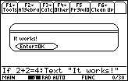

       
|Command Summary|Command Syntax|[Calculator Compatibility](68k:cross-compatibility.html)|[Token Size](6k:tokenization.html)|
|--- |--- |--- |--- |
|Sets a condition for a line or several lines to be executed.|If *condition*<br>://statement*<br>------<br>:If *condition// Then<br>…<br>:EndIf|This command works on all calculators.|2 bytes for If or If..Then;<br>2 bytes for Else;<br>2 bytes for ElseIf..Then;<br>2 bytes for EndIf.|
       
### Menu Location
Starting in the program editor:
- Press F2 to enter the Control menu.
- Press 1 to paste If.
       
# The If Command

The If command is the most basic tool in programming. The idea is simple: it checks a condition, and then does something only if the condition is true.

### If by itself

With the simplest use of If, the line after it will be skipped if the condition is false. 

In the code below, if x really is 4, then the check x=4 is true, so the program will display "x equals 4". If x is not 4, then the check will be false, so Text "x equals 4" will be skipped. Nothing will be displayed.

```
:If x=4
: Text "x equals 4"
```

### If..Then..EndIf  {#then}

To have multiple lines of code depend on the same condition, use the If *condition* Then..EndIf syntax. Every line before the EndIf will be skipped if the condition is false.

In the following example, both true→xisfour and Text "x equals 4" depend on the condition x=4.
```
:If x=4 Then
: true→xisfour
: Text "x equals 4"
:EndIf
```

### If..Then..Else..EndIf {#else}

Often, you want to do one thing if the condition is true, and another if the condition is false. The way to do this is to insert an Else into the If..EndIf block. Everything between If *condition* Then and Else is what happens when the condition is true. Everything between Else and EndIf is what happens when the condition is false.

Note: the Else command is also used inside [68k:Try](68k:try.html)..EndTry blocks.

In the following example, "x is 4" will be displayed if x=4, and "x is not 4" otherwise.
```
:If x=4 Then
: Text "x is 4"
:Else
: Text "x is not 4"
:EndIf
```

### ElseIf..Then {#elseif}

Finally, you can use ElseIf *condition* Then, inside an If..EndIf block, to consider several conditions at the same time. The way this works is: first the basic If condition is checked. If it's true, then the code just after If runs. If that condition was false, but there's an ElseIf, the ElseIf's condition is checked. If it's true, then the code just after the ElseIf runs. If *that* condition was false too, the program goes on to check the next ElseIf (if there is one), and so forth. You can also include a final Else (optionally) which will only run if no condition is met.

For example:
```
:If x=4 Then
: Text "x is 4"
:ElseIf x=5 Then
: Text "x is 5"
:ElseIf x=6 Then
: Text "x is 6"
:Else
: Text "x is neither 4, 5, nor 6"
:EndIf
```

### Conditions

What kind of conditions are possible? Any command that returns a logical value — true or false — is acceptable. This includes:
- Relational operators: [=](68k:equal.html), [≠](68k:not-equal.html), [>](68k:greater-than.html), [≥](68k:greater-than-or-equal.html), [<](68k:less-than.html), and [≤](68k:less-than-or-equal.html)
- Logical operators: [and](68k:and.html), [or](68k:or.html), [xor](68k:xor.html), [not](68k:not.html)
- Any advanced test command: [pxlTest()](68k:pxltest.html), [isPrime()](68k:isprime.html), and others.
- A variable that contains one of the values true or false, or a function that returns them.
Of course, these can also be combined: for example, isPrime(x) and x≠2 is a valid condition.

## Optimization

Use If without a Then or EndIf for only one command; use Then and EndIf otherwise.

In addition, the [when()](68k:when.html) command can often replace If.

## Error Conditions


## Related Commands

- [68k:when()](68k:when().html)
- [68k:While](68k:while.html)
- [68k:Loop](68k:loop.html)
