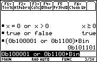

       
|Command Summary|Command Syntax|[Calculator Compatibility](68k:cross-compatibility.html)|[Token Size](6k:tokenization.html)|
|--- |--- |--- |--- |
|Tests if either of two conditions is true. <br>Can also be used as a bitwise "or" on integers.|*condition1* or *condition2*<br>*integer1* or *integer2*|This command works on all calculators.|1 byte|
       
### Menu Location
- Press 2nd MATH to enter the MATH popup menu.
- Press 8 to enter the Test submenu.
- Press 9 to select or.
       
# The or Command

The "or" operator combines two conditions into one, which will be true if either side is true, and false if both are false. You can create these conditions with the relational operators [=](68k:equal.html), [≠](68k:not-equal.html), [>](68k:greater-than.html), [≥](68k:greater-than-or-equal.html), [<](68k:less-than.html), and [≤](68k:less-than-or-equal.html), with functions such as [68k:isPrime()](68k:isprime().html), [68k:pxlTest()](68k:pxltest().html), and [68k:ptTest()](68k:pttest().html), or with any other expression that returns 'true' or 'false'. Other operators for dealing with conditions are [68k:and](68k:and.html), [68k:xor](68k:xor.html), and [68k:not](68k:not.html).

```
:2+2=4 or 1=0
           true
:2+2=5 or 1+1=3
           false
```

The operator can also be applied to integers, treating them as 32-bit signed integers (larger integers will be truncated to fit) expressed in binary. The bits will be matched up, and "or" will be applied to the bits individually — a bit in the result will be 1 if either of the two corresponding bits of the original integers was 1, and 0 otherwise.

```
:(0b11111100 or 0b00111111)▶Bin
           0b11111111
:256 or 512
           768
```

In complicated logical expressions (both with conditions and with integers), "and" has greater priority than the others ("or" and "xor"). For instance, X or Y and Z will be interpreted as X or (Y and Z).

## Error Conditions


## Related Commands

- [68k:and](68k:and.html)
- [68k:not](68k:not.html)
- [68k:xor](68k:xor.html)

## See Also

- [68k:order-of-operations](68k:order-of-operations.html)
