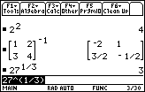

       
|Command Summary|Command Syntax|[Calculator Compatibility](68k:cross-compatibility.html)|[Token Size](6k:tokenization.html)|
|--- |--- |--- |--- |
|Raises a number to a power.|*base* ^ *exponent*|This command works on all calculators.|1 byte|
       
### Menu Location
Press the [^] key to paste ^.
       
# The ^ Command

The ^ operator is used to raise a number (the base) to a power (the exponent) — x^y is "pretty-printed" as x<sup>y</sup>. When the exponent is a positive integer, this is equivalent to multiplying the base by itself that many times.

When the base is a real number, the result will always be a real number if possible: for example (-1)^(1/3) will return -1. Some powers will return a complex number because there *is* no real number answer (or give an error, if the calculator is in real number mode). When the base is a complex number, the result will be the principal branch.

For lists, the ^ operator works componentwise — x^{a,b,c,...} will return {x^a,x^b,x^c,...}, {x,y,z,...}^a will return {x^a,y^a,z^a,...}, and two lists of the same length will be matched up element by element. 

```
:2^4
           16
:(-1)^(1/2)
           i
:0^0
           undef
```

Typing [2nd] [LN] or [♦] [LN] also pastes *e*^( — this is not a separate command (unlike the TI-83 series), and just uses the ^ operator to do its work. It is, however, the simplest way to type the constant *e*.

A minor quirk of the ^ operator is that if it's present multiple times in one expression, it is evaluated right to left (unlike most commands, which are evaluated left to right). For example, x^y^z will be interpreted as x^(y^z) rather than (x^y)^z. The reason this is done is that (x^y)^z can easily be rewritten as x^(y*z), so there's no need for two powers. x^(y^z) can't be rewritten that way. Therefore, it's much more meaningful to interpret x^y^z as x^(y^z).

## Advanced Uses

The ^ operator can be used as an alternative to an "xth root" operator, which the 68k calculators don't have. If you want to take the Nth root of a number, raise it to the 1/N-th power instead.

------

The ^ operator is also useful for square matrices. Raising a square matrix to an integer power between -32768 and 32767 just multiples the matrix by itself, taking the inverse first for negative matrices. A matrix to the 0th power is the identity.

For raising a matrix to a fractional power, or raising a number to a matrix power, a different definition is used: see [68k:matrices](68k:matrices.html#toc2). This definition is in fact compatible with the repeated-multiplication method, except that it is far more general.

None of these situations are equivalent to applying ^ to every element of a matrix. For that, see the [.^](68k:dotpower.html) command.

## Error Conditions

**[230 - Dimension](68k:errors.html#e230)** happens when non-square matrices are used with ^.
**[230 - Domain error](68k:errors.html#e230)** happens when a matrix is raised to an integer power not in the range -32768..32767.
**[665 - Matrix not diagonalizable](68k:errors.html#e665)** happens when diagonalization (used to compute most uses of ^ with matrices) fails.
**[800 - Non-real result](68k:errors.html#e800)** happens when there is no real result to return, and the calculator is in real number mode.
**[890 - Singular matrix](68k:errors.html#e890)** happens when raising a matrix with no inverse to a negative power.

## Related Commands

- [*](68k:multiply.html) (multiply)
- [/](68k:divide.html) (divide)

## See Also

- [68k:Order of Operations](68k:order-of-operations.html)
- [68k:matrices](68k:matrices.html)
