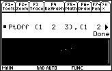

       
|Command Summary|Command Syntax|[Calculator Compatibility](68k:cross-compatibility.html)|[Token Size](6k:tokenization.html)|
|--- |--- |--- |--- |
|Erases a point on the graph screen.|PtOff *x*, *y*|This command works on all calculators.|2 bytes|
       
### Menu Location
N/A

       
# The PtOff Command

The PtOff command erases a point on the graph screen. It uses point coordinates, which means that the result is determined by [window variables](68k:system-variables.html#window): the x-coordinate must be between xmin and xmax, and the y-coordinate must be between ymin and ymax (with (xmin,ymin) being the bottom left and (xmax,ymax) the top right corner).

Unlike pixel commands such as [68k:PxlOff](68k:pxloff.html), however, PtOff won't give an error if the coordinates happen to be outside these bounds — it simply won't have any effect.

## Advanced Uses

PtOff can also be used with two lists of the same size. In that case, it will erase the points for every pair of elements (xlist[n], ylist[n]). 

## Related Commands

- [68k:PtOn](68k:pton.html)
- [68k:PtChg](68k:ptchg.html)
- [68k:PxlOn](68k:pxlon.html)
- [68k:PxlOff](68k:pxloff.html)
- [68k:PxlChg](68k:pxlchg.html)
