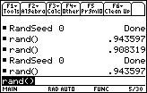

       
|Command Summary|Command Syntax|[Calculator Compatibility](68k:cross-compatibility.html)|[Token Size](6k:tokenization.html)|
|--- |--- |--- |--- |
|Seeds the random number generator.|RandSeed *value*|This command works on all calculators.|2 bytes|
       
### Menu Location
- Press 2nd MATH to enter the MATH popup menu.
- Press 7 to enter the Probability submenu.
- Press 6 to select RandSeed.
       
# The RandSeed Command

The RandSeed command seeds the random number generator. The value you use should be a positive integer: the sign and any decimals will be simply ignored.

To explain what this means, first you have to understand how pseudo-random number generators work. Every time a command like [68k:rand()](68k:rand.html) is called the calculator gives a different number — this means that the calculator must keep some variable around that changes when rand() is called. This variable is called the seed. Generating a random number is done as follows:
1. To get the number itself, apply some function that takes the seed to a real number between 0 and 1 (for a simple rand() call).
2. If a different type of random number is needed (e.g. a random integer), the real number 0..1 is adjusted in some way.
3. The seed itself is updated by some carefully chosen mathematical operation.

"Seeding" the random number generator means setting the seed to some specific value. This is done for two reasons:
- To ensure randomness, you might seed the random generator with the current time — that way, it's guaranteed to be different every second of every day.
- Every time you seed the random number generator with a specific number, the random numbers that follow will be the same. For example, the following output is guaranteed to be the same on all calculators every time (except for formatting):

```
:RandSeed 100
:rand()
           .556077
:rand()
           .590054
```

## Advanced Uses

Seed the RNG with the current time by using the following command:
```
:RandSeed startTmr()
```

------

The random number generator is very popular as an encryption method to implement on calculators. This is done as follows:

1. Use the encryption key as a random number seed.
2. Do something to the text to be encrypted that involves random numbers (e.g. a randomly generated [One-Time Pad](https://en.wikipedia.org/wiki/one-time_pad))
3. To decrypt, use the encryption key as a seed, and reverse the operation above.

Most of the security of this method lies in the obscurity of the random number generator. Someone that has read this page (or someone from Texas Instruments) could break the code in a matter of seconds on a computer; and if they knew anything at all about the message, they could probably break the code with just a calculator.

------

In general, after you mess with the random number seed, you must 'restore randomness' somehow — otherwise, every time you run that program, random numbers will be the same afterwards every time. Using [68k:startTmr()](68k:starttmr.html) as above is one way of doing so; another is generating a random integer before you run RandSeed, and using it as the seed at the end. For example:
```
:rand(10^10) →r
:RandSeed 0

(code with predictable random numbers)

:RandSeed r
```

## The RNG Algorithm

The algorithm used by the calculator to generate random numbers is known as [L'Ecuyer's algorithm](http://portal.acm.org/citation.cfm?doid-62959.62969). This particular implementation works as follows.

The following constants are used:
```
:2147483563→mod1
:2147483399→mod2
:40014→mult1
:40692→mult2
```

RandSeed n is equivalent to the following code:
```
:abs(int(n))→n
:If n=0 Then
: 12345→seed1
: 67890→seed2
:Else
: mod(mult1*n,mod1)→seed1
: mod(n,mod2)→seed2
:EndIf
```

rand() is equivalent to the following code:
```
:Local result
:mod(seed1*mult1,mod1)→seed1
:mod(seed2*mult2,mod2)→seed2
:(seed1-seed2)/mod1→result
:If result<0
: result+1→result
:Return result
```

## Related Commands

- [68k:rand()](68k:rand.html)
- [68k:randMat()](68k:randmat.html)
- [68k:randNorm()](68k:randnorm.html)
- [68k:randPoly()](68k:randpoly.html)
