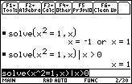

       
|Command Summary|Command Syntax|[Calculator Compatibility](68k:cross-compatibility.html)|[Token Size](6k:tokenization.html)|
|--- |--- |--- |--- |
|Substitutes a value for a variable temporarily.|*expression*|This command works on all calculators.|1 byte|
       
### Menu Location
Press the
       
# The | Command

The | operator (which nobody seems to know how to pronounce, although TI suggests "with") temporarily sets a variable to some value, just for a single evaluation. For example:
```
:x^2+2x+1|x=5
           6
```
Using the | operator doesn't actually affect the value of the variable. However, it will work both if the variable is undefined, and if the variable already has a different value. 

Only one | can occur in a single expression: if you have more, this will either cause an error or ignore all but the first substitution, depending on placement. However, one | is enough for any number of variables: just separate the values to use with [68k:and](68k:and.html):
```
:x+y|x=2 and y=2
           4
```

## Advanced Uses

The | operator has a more complicated use: rather than giving a specific value for a variable, you might give a condition (or several conditions) for its value, using the [>](68k:greater-than.html), [≥](68k:greater-than-or-equal.html), [<](68k:less-than.html), and [≤](68k:less-than-or-equal.html) operators. This condition will be used if it helps simplify the expression, especially with [68k:solve()](68k:solve.html). For instance:
```
:abs(x)|x<0
           -x
```

Weird things can happen if you do this to a variable whose value is already defined, however:
```
:5→x
           5
:abs(x)|x<0
           |undef|
```

## Optimization

If a complicated expression has a repeating element, you may be able to make the calculation smaller and faster by replacing this repeating element with a variable, for which you substitute the correct value. For example (here the repeating element is √(1-x^2)):
```
:x√(1-x^2)+tanֿ¹(x/√(1-x^2))

can be

:x*a+tanֿ¹(x/a)|a=√(1-x^2)
```
A related trick is to make a substitution with a function, for an operation that has to be done several times in a single line. For example:
```
:a*(a-1)/2+b*(b-1)/2+c*(c-1)/2

can be

:f(a)+f(b)+f(c)|f(x)=x*(x-1)/2
```

## Error Conditions


## Related Commands

- [→](68k:store.html)
- [68k:Local](68k:local.html)
