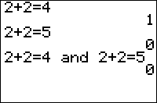

           
|Command Summary|Command Syntax|[Calculator Compatibility](compatibility.html)|[Token Size](tokens.html)|
|--- |--- |--- |--- |
|Returns the logical value of *value1* and *value2* being true.|*value1* and *value2*|TI-83/84/+/SE/CSE/CE|1 byte|

### Menu Location
Press:<br># 2nd TEST to access the test menu.<br># RIGHT to access the LOGIC submenu.<br># ENTER to select and.
# The and Command

`and` takes two numbers, variables, or expressions and tests to see if they are both True (not equal to 0).  If they are, it returns 1.  If either input is False (0), it returns 0.  Note that the order of the operators doesn't matter (i.e. `and` is commutative), and that multiple `and`'s can be used together

```:0 and 0 
           0

:0 and 1
           0 

:1 and 2           (2 counts as True, just like one)
           1

:1→X
:X and 2+2         (you can use variables and expressions)
           1

:1 and 1 and 2-2   (the last input evaluates to 0, or false)
           0
```

## Optimization

[Multiplying](multiply.html) two values has the same truth value as `and`; thus, `and` can sometimes be replaced by multiplication. Because the calculator does implicit multiplication, meaning it automatically recognises when you want to multiply, you don't need to use the * sign.

```
:If A and B
can be
:If AB
```

However, do not use this optimization if A and B might be expected to take on large values, as an overflow error might occur.

## Related Commands

- [`or`](or.html)
- [`xor`](xor.html)
- [`not(`](not.html)
