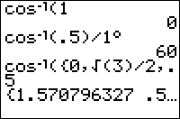

           
|Command Summary|Command Syntax|[Calculator Compatibility](compatibility.html)|[Token Size](tokens.html)|
|--- |--- |--- |--- |
|Returns the inverse cosine (also called arccosine)|cosֿ¹(*number*)|TI-83/84/+/SE|1 byte|

### Menu Location
Press:<br># [2nd]<br># [cosֿ¹]
# The cosֿ¹( Command

`cosֿ¹(` returns the [arccosine](http://mathworld.wolfram.com/inversecosine.html) of its argument. It is the inverse of [`cos(`](cos.html), which means that `cosֿ¹(n)` produces an angle θ such that `cos(θ)`=n.

Like `cos(`, the result of `cosֿ¹(` depends on whether the calculator is in [Radian](radian-mode.html) or [Degree](degree-mode.html) mode. However, unlike cosine, the result is in degrees or radians, not the argument. A full rotation around a circle is 2π radians, which is equal to 360°. The conversion of θ=`cosֿ¹(n)` from radians to degrees is θ*180/π and from degrees to radians is θ*π/180.  The `cosֿ¹(` command also works on a list.

The `cosֿ¹(` function can be defined for all real and complex numbers, but assumes real values only in the closed interval [-1,1]. Because Z80 calculators have their trigonometric functions and inverses restricted only to real values, the calculator will throw [ERR:DOMAIN](errors.html#domain) if the argument is outside of this interval, no matter what the mode setting may be.

In radians:
```
:cosֿ¹(-1)
    3.141592654
```
In degrees:
```
:cosֿ¹(-1)
    180
```

## Advanced Uses

Since the function cosine itself doesn't have the restrictions that arccosine does, and since arccosine is the inverse of cosine, you can use `cosֿ¹(cos(` to keep a variable within a certain range (most useful for the [home screen](homescreen.html)). Here is an example for a game like [pong](pong.html). The ball travels between 0 and 12.

You could use a flag like this:
```
:If X=12 or not(X 	\\ X is the position
:-D→D		\\ D is the direction
:X+D→X		\\ new position
:Output(8,X,"=
```

An easier way to do this, without needing a flag or even an [`If`](if.html) statement, is using `cosֿ¹(cos(`
```
:X+1→X		\\ Note: the calculator is in Degree mode
:Output(8,cosֿ¹(cos(15X))/15,"=")	\\ I used 15 because cosֿ¹ ranges from [0,180]
										and X from [0,12],  so 180/12=15
```

## Error Conditions

- **[ERR:DOMAIN](errors.html#domain)** is thrown if you supplied an argument outside the interval [-1,1]
- **[ERR:DATA TYPE](errors.html#datatype)** is thrown if you input a complex value or a matrix.

## Related Commands

- [`sin(`](sin.html)
- [`sinֿ¹(`](arcsin.html)
- [`cos(`](cos.html)
- [`tan(`](tan.html)
- [`tanֿ¹(`](arctan.html)
