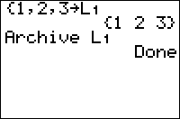

           
|Command Summary|Command Syntax|[Calculator Compatibility](compatibility.html)|[Token Size](tokens.html)|
|--- |--- |--- |--- |
|Moves a variable from RAM to the archive.|Archive *variable*|TI-83+/84+/SE  (not available on the regular TI-83)|2 bytes|

### Menu Location
Press: # 2nd MEM to access the memory menu # 5 to select Archive, or use arrows
# The Archive Command

The `Archive` command moves a variable from [RAM](glossary.html#ram) to the archive (also known as [ROM](glossary.html#tom)). A quick synopsis of the difference between the two:
- Data in the archive cannot be accessed, but it's protected from RAM clears (which may occur during battery removal if not done carefully); also, the archive can hold much more data.
- Data in RAM can be accessed for calculations, but it can also be deleted during a RAM clear or accidentally overwritten by another program.

Nothing happens if the variable in question is already archived.

You might want to use this command to protect data such as saved games from being accidentally deleted. It's not, in general, a good idea to archive commonly used variables, such as the real variables A-Z, since programs usually expect to be able to access these variables without problems, and won't check if they're archived.

Also, some variables cannot be archived. These include:
- The real variables R, T, X, Y, θ, and *n* (due to their use in graphing)
- The [equation](system-variables.html#equation) variables Yn, XnT, YnT, rn, u, v, and w
- The stat plots Plot*#*
- [Window](system-variables.html#window), table, and zoom variables such as TblInput or Xmin
- [Statistical](system-variables.html#statistical) variables and the list ∟RESID
- [Finance](system-variables.html#finance) variables

Finally, the `Archive` command does not work on programs when using it from a program (it does, however, archive programs from the home screen). However, an [assembly program](hexcodes.html#toc0) can be executed as a subroutine so that `Archive` and [`UnArchive`](unarchive.html) can be used within a program. The program should however be run again afterwards.

## Advanced Uses

As archived variables (and programs) can not be accessed by the calculator's inbuilt OS, archiving programs can be quite problematic when trying to execute them. However; by enabling your programs to be viewable in [assembly shells](asmshells.html), you can execute your programs without needing to unarchive them first. This is because the assembly shell *copies* the program to the RAM automatically, and is then executed. Closing the program will automatically remove the copy from the RAM, so no RAM is lost in the end.

## Error Conditions

- **[ERR:ARCHIVE FULL](errors.html#archivefull)** is thrown when there isn't enough space in the archive for the variable.
- **[ERR:INVALID](errors.html#invalid)** is thrown when trying to archive a program from within a program.
- **[ERR:VARIABLE](errors.html#variable)** is thrown when trying to archive a variable that cannot be archived.

## Related Commands

- [`UnArchive`](unarchive.html)
- [`DelVar`](delvar.html)
