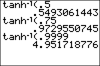

           
|Command Summary|Command Syntax|[Calculator Compatibility](compatibility.html)|[Token Size](tokens.html)|
|--- |--- |--- |--- |
|Calculates the inverse hyperbolic tangent of a value.|tanhֿ¹(*value*)|TI-83/84/+/SE|1 byte|

### Menu Location
The tanhֿ¹( command is only found in the catalog. Press:
1. 2nd CATALOG to access the command catalog.
2. T to skip to commands starting with T.
3. Scroll down and select tanhֿ¹(
       
# The tanhֿ¹( Command

The tanhֿ¹( command calculates the inverse hyperbolic tangent of a value. tanhֿ¹(x) is the number y such that x = tanh(y).

tanhֿ¹(x), although it can be defined for all real and complex numbers, is real-valued only for x in the open interval (-1,1). Since Z80 calculators have their hyperbolic functions and inverses restricted to real values, [ERR:DOMAIN](errors.html#domain) is thrown when x is outside the interval (-1,1).

The tanhֿ¹( command also works for lists.

```
tanhֿ¹(0)
	0
tanhֿ¹({-.5,.5})
	{-.5493061443 .5493061443}
```

## Error Conditions

- **[ERR:DOMAIN](errors.html#domain)** when taking the inverse tanh of a number not between -1 and 1.

## Related Commands

- [sinh(](sinh.html)
- [sinhֿ¹(](arsinh.html)
- [cosh(](cosh.html)
- [coshֿ¹(](arcosh.html)
- [tanh(](tanh.html)
