# ASCII Output Codes
The following table proposes an extension to the (incomplete) set of ASCII codes classically exported by TI-GRAPH LINK, emulated by those with limited access to better portrayals of targeted characters, and utilized by those seeking to preserve their content in the 7-bit range. Each consists of no more than eight characters.

Cells containing symbols that already have 7-bit encodings are omitted. This includes letters and digits, brackets and other punctuation, and the alternate figures found on the number keys of most keyboard layouts. Each of these items can be typed out like normal, or encased in backslashes wherever convenient or necessary.

This is an alternative, often last-resort approach to rendering the TI-83 Plus font on a computer. Environments that support UTF-8 might be more well-suited for Unicode characterizations that rise above the 7-bit limit. For ways to represent TI-83 Plus characters in their full splendor, see the [TI-83 Plus Large Font](83lgfont.html) article.

| || || || || ||~ Table of ASCII Output Codes |
| ||~ 01–7F | ||~ 80–A6 | ||~ A7–CD | ||~ CE–F4 |
|=  01 |= \n\ |=  80 |= \0\ |=  A7 |= \ograve\ |=  CE |= \...\ |
|=  02 |= \u\ |= 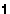 81 |= \1\ |= 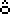 A8 |= \ocirc\ |=  CF |= \<\ |
|=  03 |= \v\ |= 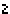 82 |= \2\ |=  A9 |= \ouml\ |=  D0 |= \block\ |
|=  04 |= \w\ |=  83 |= \3\ |=  AA |= \Uacute\ |=  D1 |= \per\ |
|= 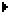 05 |= \>\ |=  84 |= \4\ |= 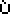 AB |= \Ugrave\ |= 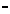 D2 |= \-\ |
|=  06 |= \squp\ |=  85 |= \5\ |=  AC |= \Ucirc\ |=  D3 |= \area\ |
|=  07 |= \sqdown\ |=  86 |= \6\ |= 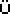 AD |= \Uuml\ |=  D4 |= \^box\ |
|=  08 |= \intgrl\ |=  87 |= \7\ |=  AE |= \uacute\ |= 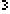 D5 |= \^3\ |
|=  09 |= \x\ |=  88 |= \8\ |=  AF |= \ugrave\ |=  D6 |= \enter\ |
|=  0A |= \box\ |=  89 |= \9\ |=  B0 |= \ucirc\ |= 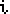 D7 |= \i\ |
|=  0B |= \cross\ |=  8A |= \Aacute\ |=  B1 |= \uuml\ |=  D8 |= \p^\ |
|= 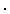 0C |= \dot\ |=  8B |= \Agrave\ |= 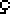 B2 |= \Ccedil\ |=  D9 |= \chi\ |
|=  0D |= \subT\ |=  8C |= \Acirc\ |=  B3 |= \ccedil\ |= 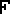 DA |= \statF\ |
|= 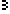 0E |= \root3\ |= 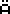 8D |= \Auml\ |=  B4 |= \Ntilde\ |= 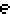 DB |= \e\ |
|= 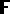 0F |= \hexF\ |=  8E |= \aacute\ |=  B5 |= \ntilde\ |= 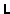 DC |= \L\ |
|=  10 |= \root\ |=  8F |= \agrave\ |=  B6 |= \acute\ |= 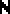 DD |= \N\ |
|= 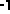 11 |= \^-1\ |= 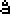 90 |= \acirc\ | ||= ... |=  DE |= \))\ |
|=  12 |= \^2\ |= 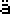 91 |= \auml\ |=  B8 |= \..\ |=  DF |= \blk->\ |
|= 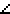 13 |= \/_\ |= 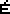 92 |= \Eacute\ |= 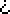 B9 |= \iquest\ |=  E0 |= \cursor\ |
|=  14 |= \o\ |=  93 |= \Egrave\ |=  BA |= \iexcl\ |=  E1 |= \2ndcur\ |
|=  15 |= \r\ |=  94 |= \Ecirc\ |=  BB |= \alpha\ |=  E2 |= \Acur\ |
|=  16 |= \^T\ |= 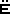 95 |= \Euml\ |=  BC |= \beta\ |=  E3 |= \acur\ |
|= 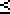 17 |= \<=\ |= 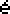 96 |= \eacute\ |= 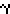 BD |= \gamma\ |=  E4 |= \inscur\ |
|= 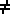 18 |= \!=\ |= 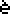 97 |= \egrave\ |=  BE |= \Delta\ |= 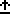 E5 |= \ins2nd\ |
|=  19 |= \>=\ |=  98 |= \ecirc\ |= 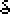 BF |= \delta\ |=  E6 |= \ins_A\ |
|= 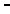 1A |= \(-)\ |=  99 |= \euml\ |=  C0 |= \epsil\ |= 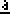 E7 |= \ins_a\ |
|=  1B |= \EE\ |=  9A |= \Iacute\ | ||= ... |=  E8 |= \gline1\ |
|=  1C |= \->\ |= 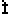 9B |= \Igrave\ |= 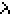 C2 |= \Lambda\ |= 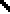 E9 |= \gline2\ |
|=  1D |= \10\ |=  9C |= \Icirc\ |=  C3 |= \mu\ |=  EA |= \gabove\ |
|=  1E |= \uarrow\ |=  9D |= \Iuml\ |=  C4 |= \pi\ |=  EB |= \gbelow\ |
|= 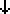 1F |= \darrow\ |=  9E |= \iacute\ |=  C5 |= \rho\ |=  EC |= \gpath\ |
| ||= ... |= 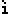 9F |= \igrave\ |= 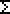 C6 |= \Sigma\ |= 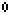 ED |= \ganim\ |
|=  24 |= \^4\ |=  A0 |= \icirc\ |=  C7 |= \sigma\ |=  EE |= \gdot\ |
| ||= ... |= 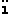 A1 |= \iuml\ |=  C8 |= \tau\ |=  EF |= \upblk\ |
|=  5B |= \theta\ |=  A2 |= \Oacute\ |= 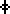 C9 |= \phi\ |=  F0 |= \dnblk\ |
| ||= ... |= 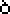 A3 |= \Ograve\ |= 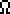 CA |= \Omega\ |=  F1 |= \chkrbd\ |
|=  60 |= \lsquo\ |= 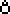 A4 |= \Ocirc\ |=  CB |= \xbar\ | ||= ... |
| ||= ... |= 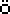 A5 |= \Ouml\ |=  CC |= \ybar\ |=  F3 |= \squp_2\ |
|= 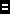 7F |= \=\ |= 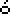 A6 |= \oacute\ |= 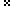 CD |= \^x\ |=  F4 |= \szlig\ |
