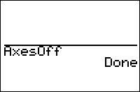

           
|Command Summary|Command Syntax|[Calculator Compatibility](compatibility.html)|[Token Size](tokens.html)|
|--- |--- |--- |--- |
|Disables the X- and Y- axes on the graph screen.|AxesOff|TI-83/84/+/SE|2 bytes|

### Menu Location
Press:
1. 2nd FORMAT to access the format menu.
1. Use arrows and ENTER to select AxesOff.
       
# The AxesOff Command

The `AxesOff` command disables the X and Y axes on the graph screen, so that they aren't drawn. They can be enabled again with the [`AxesOn`](axeson.html) command.

(the y=x line that is drawn when both [`Seq`](seq-mode.html) and [`Web`](web.html) modes are enabled is also controlled by this command)

Generally, the `AxesOff` command should be used at the beginning of the program to disable the axes if the program is going to use the graph screen, since the axes get in the way. However, you should consider using [`StoreGDB`](storegdb.html) and [`RecallGDB`](recallgdb.html) to save this setting if that's the case.

## Related Commands

- [`AxesOn`](axeson.html)
- [`LabelOn`](labelon.html)
- [`LabelOff`](labeloff.html)
