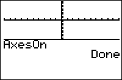

           
|Command Summary|Command Syntax|[Calculator Compatibility](compatibility.html)|[Token Size](tokens.html)|
|--- |--- |--- |--- |
|Enables the X- and Y- axes on the graph screen.|AxesOn|TI-83/84/+/SE|2 bytes|

### Menu Location
Press:
1. 2nd FORMAT to access the format menu.
1. Use arrows and ENTER to select AxesOn.
       
# The AxesOn Command

The `AxesOn` command enables the X and Y axes on the graph screen, so that they are drawn. They can be disabled with the [`AxesOff`](axesoff.html) command.

(the y=x line that is drawn when both [`Seq`](seq-mode.html) and [`Web`](web.html) modes are enabled is also controlled by this command)

## Related Commands

- [`AxesOff`](axesoff.html)
- [`LabelOn`](labelon.html)
- [`LabelOff`](labeloff.html)
