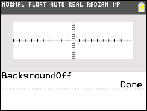

           
|Command Summary|Command Syntax|[Calculator Compatibility](compatibility.html)|[Token Size](tokens.html)|
|--- |--- |--- |--- |
|Turns off the graph Background, setting it back to the default white color.|BackgroundOff|TI-84+CE/CSE|2 bytes|

### Menu Location
[2ND][PRGM][LEFT ARROW][2]
# The BackgroundOff Command


The `BackgroundOff` command has only one purpose: turn the background off. Run the command on its own line in a program with no other characters or arguments.

```
:BackgroundOn BLUE //Makes background blue
:BackgroundOff //Makes background white again
```

## Optimization

`BackgroundOff` does essentially the same thing as turning the background on to the color white, as shown below.

```
:BackgroundOn WHITE
can be
:BackgroundOff
```

## Related Commands

- [`BackgroundOn`](http://tibasicdev.github.io/backgroundon)
