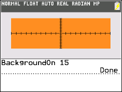

           
|Command Summary|Command Syntax|[Calculator Compatibility](compatibility.html)|[Token Size](tokens.html)|
|--- |--- |--- |--- |
|Used to display a background image on the graphscreen|BackgroundOn *Image#*<br>Background *color*<br>Background *# (0-24)*|TI-84+CSE and TI-84+CE|2 bytes|

### Menu Location
Press
1. 2ND DRAW to access the draw menu
1. Navigate to BACKGROUND submenu
1. Enter or 1 to select BackgroundOn
       
# The BackgroundOn Command

With the introduction of color and a higher resolution screen than the monochrome calculators, the TI-84+CSE and TI-84+CE included the ability to display a background image on the graphscreen. The images variables are similar to the picture variables in that there 10 slots. In addition, functions can be drawn on top of images. 

`BackgroundOn` recalls an image variable or color and displays it on the graphscreen. 

```
:BackgroundOn Image1
is the same as
:BackgroundOn 1
```

Intrestingly, the following is a valid syntax, which fills the graphscreen with a light blue (18).

```
:15→B
:BackgroundOn B+3
```

In addition, `BackgroundOn` can be used to fill the graphscreen with a solid color. The color variables range from 10 to 24, blue to dark gray, as documented [here](textcolor.html). For example, `BackgroundOn` 12 will fill the graphscreen with black.

```
:BackgroundOn 12
```


## Error Conditions

- **[ERR:DOMAIN](errors.html#dimmismatch)** is thrown if the number is not an integer between 0 and 24.

## Related Commands

- [`BackgroundOff`](backgroundoff.html)
- [`RecallPic`](recallpic.html)
