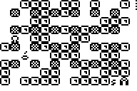

# Bomberman

|Program Summary|Program Size|Uses Libraries?|Calculator Compatibility|Author|Download|
| --- | --- | --- | --- | --- | --- |
|A quality version of the classic bomberman game.|4,969 bytes|No, it's pure TI-Basic|TI-83+/84/+/SE|[Travis Fischer](http://www.ticalc.org/archives/files/authors/78/7869.html)|[bomberman.zip](http://tibasicdev.github.io/local--files/bomberman/bomberman.zip)|

This is a graphical rendition of the classic Bomberman genre! The objective of the game is to progress through as many levels as you can, blowing up enemies/bricks and making it safely to the exit. Features include multiple level setups, difficulty settings, randomly generated levels, in-game instructions, and excellent animated graphics.
