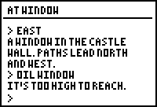

# Castle Adventure

|Program Summary|Program Size|Uses Libraries?|Calculator Compatibility|Author|Download|
| --- | --- | --- | --- | --- | --- |
|A quality text adventure game.|6,700 bytes|No, it's pure TI-Basic|TI-83/84/+/SE|[Arthur O'Dwyer](http://www.club.cc.cmu.edu/-ajo/)|[castleadventure.zip](http://tibasicdev.github.io/local--files/castle-adventure/castleadventure.zip)|

Castle Adventure is a text adventure game in the style of Infocom or "Colossal Cave". Your goal is to enter the castle and make off with the king's treasure. To achieve this goal, you must solve puzzles by interacting with the game using simple English commands.

The game uses full-text interaction, and an innovative input system. When the game is ready to accept input, a caret ">" will appear on the last line of the screen. Press an alphabetic key, and a word beginning with that letter will appear on the input line. For example, your first move might be to go WEST from the castle gate; therefore, you'd press the W key, and see the fully-formed word WEST appear on the input line.
