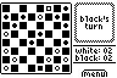

# Checkers

|Program Summary|Program Size|Uses Libraries?|Calculator Compatibility|Author|Download|
| --- | --- | --- | --- | --- | --- |
|A quality version of the classic checkers game.|13,249 bytes|No, it's pure TI-Basic|TI-83/84/+/SE|[nitacku](http://www.ticalc.org/archives/files/authors/90/9071.html)|[checkers.zip](http://tibasicdev.github.io/local--files/checkers/checkers.zip)|

Checkers is a one or two player game that follows the standard checker rules for acceptable moves and scoring. The game features several customizable options, including saving and loading, who gets what color pieces, and an ability to change the game rules so that you can jump over your own pieces.

The true highlight of this game, though, is its great AI. It comes with three levels of difficulty, with the strength of the AI being easy, medium, or hard. Unlike other games that just use a simple random number to decide which move the AI will take, this game actually uses sophisticated logic based on the rules of checkers. And to make the AI even better, you can have the AI play against itself.
