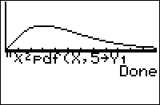

           
|Command Summary|Command Syntax|[Calculator Compatibility](compatibility.html)|[Token Size](tokens.html)|
|--- |--- |--- |--- |
|Evaluates the χ² probability density function at a point.|χ²pdf(*x*, *df*|TI-83/84/+/SE|2 bytes|

### Menu Location
Press:
1. 2ND DISTR to access the distribution menu
2. 6 to select χ²pdf(, or use arrows.
Press 7 instead of 6 on a TI-84+/SE with OS 2.30 or higher.
       
# The χ²pdf( Command

`χ²pdf(` is the χ² probability density function. 

Since the χ² distribution is continuous, the value of `χ²pdf(` doesn't represent an actual probability — in fact, one of the only uses for this command is to draw a graph of the χ² curve. You could also use it for various calculus purposes, such as finding inflection points. 

The command takes two arguments: the value at which to evaluate the p.d.f., and *df*, the number of 'degrees of freedom'. 

## Formulas

The value of `χ²pdf(` is given by

$$\operatorname{\chi^2pdf}(x,k)=\frac{(1/2)^{k/2}}{(k/2-1)!}\,x^{k/2-1}e^{-x/2}$$

## Related Commands

- [`χ²cdf(`](chisquarecdf.html)
- [`Shadeχ²(`](shadechisquare.html)
