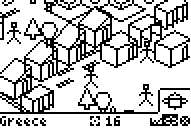

# Civilization Simulator

|Program Summary|Program Size|Uses Libraries?|Calculator Compatibility|Author|Download|
| --- | --- | --- | --- | --- | --- |
|A quality version of the classic Sims game.|13KB|No, it's pure TI-Basic|TI-83/84/+/SE|[Kerm Martian](http://www.cemetech.net/)|[civilizationsimulator.zip](http://tibasicdev.github.io/local--files/civilization-simulator/civilizationsimulator.zip)|

Modeled on popular computer games, Civilization Simulator lets you control and build an ancient civilization. It uses the ps3d engine, built specifically for this purpose, that provides extremely good graphics in 3D. You start with a blank world and must create people, structures, and trade for your people. The goal is to earn food and wood; when you have enough and have completed sufficient research, you can advance to the next age. After the successful completion of the third age, you win.
