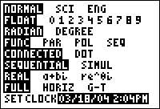

           
|Command Summary|Command Syntax|[Calculator Compatibility](compatibility.html)|[Token Size](tokens.html)|
|--- |--- |--- |--- |
|Turns off the clock display in the mode screen.|ClockOff|TI-84+/SE|2 bytes|

### Menu Location
This command can only be found in the catalog. Press:
1. 2nd CATALOG to enter the command catalog
2. C to skip to command starting with C
3. Scroll down to ClockOff and select it
       
# The ClockOff Command

The `ClockOff` command turns off the clock display at the bottom of the [mode screen](settings.html) on the TI-84+/SE calculators. You can turn the clock back on by using the [`ClockOn`](clockon.html) command, or by selecting 'TURN CLOCK ON' ,displayed in place of the clock on the mode screen.

The `ClockOff` command does not actually turn the clock off. The time can still be accessed through use of the [`getTime`](http://tibasicdev.github.io/gettime) and [`getDate`](http://tibasicdev.github.io/getdate) commands, and all their cousins.

## Related Commands

- [`ClockOn`](clockon.html)
- [`getTime`](gettime.html)
- [`getDate`](getdate.html)
