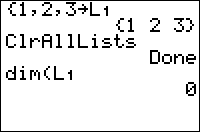

           
|Command Summary|Command Syntax|[Calculator Compatibility](compatibility.html)|[Token Size](tokens.html)|
|--- |--- |--- |--- |
|Sets the size of all defined lists to 0 (equivalent to applying the [ClrList](clrlist.html) command to all defined lists).|ClrAllLists|TI-83/84/+/SE|2 bytes|

### Menu Location
Press:
1. 2nd MEM to access the Memory menu
1. 4 to select ClrAllLists, or use arrows
       
# The ClrAllLists Command

The `ClrAllLists` command sets the dimension (length) of all lists to zero. This is virtually equivalent to deleting the lists, except for two differences:

- The lists still exist and will show up in the list menu and the memory management menu.
- The [`dim(`](dim.html) command will return 0 for a cleared list, rather than an error.

However, accessing a cleared list in any other way will return an error, just as for a deleted list.

The `ClrAllLists` command should **never** be used in a program you give to someone else or upload - unless the user is aware of this effect, they might lose important data stored in one of their lists. There is no way to limit the effect of `ClrAllLists`, so a program should use [`ClrList`](clrlist.html) instead to avoid affecting unrelated lists (this is assuming you already want to use this questionably-useful effect).

Outside a program (or in a program for personal use), you might use this command to clear the contents of your lists to free up memory, while still not deleting the lists. This might possibly be convenient. Maybe.

## Related Commands

- [`ClrList`](clrlist.html)
- [`DelVar`](delvar.html)
- [`dim(`](dim.html)
