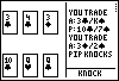

# Commerce

|Program Summary|Program Size|Uses Libraries?|Calculator Compatibility|Author|Download|
| --- | --- | --- | --- | --- | --- |
|A quality card game with AI.|5,300 bytes|No, it's pure TI-Basic|TI-83/84/+/SE|[Arthur O'Dwyer](http://www.club.cc.cmu.edu/-ajo/)|[commerce.zip](http://tibasicdev.github.io/local--files/commerce/commerce.zip)|

Commerce is a three to five player game similar to Rummy, played against two to four computer opponents. There is no automated scoring in this game; rather the goal is to simply win more hands than your opponents. This game features some decent graphics and gameplay, as well as demonstrating good programming practices and code.
