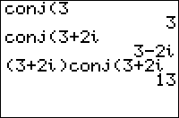

           
|Command Summary|Command Syntax|[Calculator Compatibility](compatibility.html)|[Token Size](tokens.html)|
|--- |--- |--- |--- |
|Calculates the complex conjugate of a complex number.|conj(*value*)|TI-83/84/+/SE|2 bytes|

### Menu Location
Press:<br># MATH to access the [math](math.html) menu.<br># RIGHT, RIGHT to access the CPX (complex) submenu<br># ENTER to select conj(.
# The conj( Command

`conj(*z*)` returns the complex conjugate of the complex number *z*. If *z* is represented as *x*+i*y* where *x* and *y* are both real, `conj(*z*)` returns *x*-i*y*. Also works on a list of complex numbers.
```
conj(3+4i)
     3-4i
```

The conjugate of a number $z$ is often written $\overline{z}$, and is useful because it has the property that $z\overline{z}$ and $z+\overline{z}$ are real numbers.

## Related Commands

- [`abs(`](abs.html)
- [`angle(`](angle.html)
- [`real(`](real-func.html)
- [`imag(`](imag.html)
