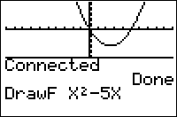

           
|Command Summary|Command Syntax|[Calculator Compatibility](compatibility.html)|[Token Size](tokens.html)|
|--- |--- |--- |--- |
|Sets all equations to use the connected graphing style, and makes it the default setting.|Connected|TI-83/84/+/SE (Not available on TI-84+CE calculators)|2 bytes|

### Menu Location
Press:
1. MODE to access the mode menu.
2. Use arrows to select Connected.
       
# The Connected Command

The `Connected` command sets all equations to use the usual graph style - a connected line. In addition, this graph style is made the default, so that when a variable is deleted it will revert to this graph style. The other possible setting for this option is [`Dot`](dot.html).

Compare this to the [`GraphStyle(`](graphstyle.html) command, which puts a single equation into a specified graph style.

The `Connected` and `Dot` commands don't depend on [graphing mode](graphing-mode.html), and will always affect all functions, even in other graphing modes. The exception to this is that [`sequence`](seq-mode.html) mode's default is always the dotted-line style, even when `Connected` mode is set. The `Connected` command will still change their graphing style, it just won't change the default they revert to.

In addition to graphing equations, this setting also affects the output of [`DrawF`](drawf.html), [`DrawInv`](drawinv.html), and [`Tangent(`](tangent.html).

## Related Commands

- [`Dot`](dot.html)
- [`GraphStyle(`](graphstyle.html)
