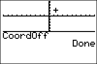

           
|Command Summary|Command Syntax|[Calculator Compatibility](compatibility.html)|[Token Size](tokens.html)|
|--- |--- |--- |--- |
|Turns off the cursor coordinate display on the graph screen.|CoordOff|TI-83/84/+/SE|2 bytes|

### Menu Location
Press: # 2nd FORMAT to access the graph format menu # Use arrows and ENTER to select CoordOff
# The CoordOff Command

When moving a cursor on a screen, it's possible for the calculator to display the coordinates of the current point (either polar or rectangular coordinates, depending on which of [`RectGC`](rectgc.html) or [`PolarGC`](polargc.html) is set). The `CoordOff` command turns off this option.

To turn it on, use the [`CoordOn`](coordon.html) command. 

## Related Commands

- [`CoordOn`](coordon.html)
- [`RectGC`](rectgc.html)
- [`PolarGC`](polargc.html)
