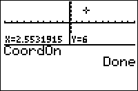

           
|Command Summary|Command Syntax|[Calculator Compatibility](compatibility.html)|[Token Size](tokens.html)|
|--- |--- |--- |--- |
|Turns on the cursor coordinate display on the graph screen.|CoordOn|TI-83/84/+/SE|2 bytes|

### Menu Location
Press:
1. 2nd FORMAT to access the graph format menu
2. Use arrows and ENTER to select CoordOn
       
# The CoordOn Command

When moving a cursor on a screen, it's possible for the calculator to display the coordinates of the current point (either polar or rectangular coordinates, depending on which of [`RectGC`](rectgc.html) or [`PolarGC`](polargc.html) is set). The `CoordOn` command turns on this option (to disable it, use the [`CoordOff`](coordoff.html) command).

The coordinates are displayed in practically every situation when you're moving a cursor on the graph screen, even including the [`Trace`](trace.html), [`Input`](input.html) or [`Select(`](select.html) commands in a program. The interactive mode of [`Text(`](text.html) and the `Pen` tool are the exceptions — this is because these two situations involve a pixel coordinate, and not a point.

## Related Commands

- [`CoordOff`](coordoff.html)
- [`RectGC`](rectgc.html)
- [`PolarGC`](polargc.html)
