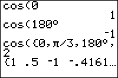

           
|Command Summary|Command Syntax|[Calculator Compatibility](compatibility.html)|[Token Size](tokens.html)|
|--- |--- |--- |--- |
|Returns the cosine of a real number.|cos(*angle*)|TI-83/84/+/SE|1 byte|

### Menu Location
Press [COS]
       
# The cos( Command

`cos(θ)` returns the [cosine](http://mathworld.wolfram.com/cosine.html) of θ, which is defined as the x-value of the point of intersection of the unit circle and a line containing the origin that makes an angle θ with the positive x-axis

The value returned depends on whether the calculator is in [`Radian`](radian-mode.html) or [`Degree`](degree-mode.html) mode. A full rotation around a circle is 2π radians, which is equal to 360°. The conversion from radians to degrees is angle*180/π and from degrees to radians is angle*π/180. The `cos(` command also works on a list of real numbers.

In radians:
```
cos(π/3)
    .5
```

In degrees:
```
cos(60)
    .5
```

## Advanced Uses

You can bypass the mode setting by using the [`°`](degree-symbol.html) (degree) and `<sup>[r](radian-symbol.html)</sup>` (radian) symbols.  These next two commands will return the same values no matter if your calculator is in degrees or radians:
```
cos(60°)
    .5
```
```
cos(π/3ֿ¹ )
    .5
```

## Error Conditions

- **[ERR:DATA TYPE](errors.html#datatype)** is thrown if you supply a matrix or a complex argument.
- **[ERR:ARGUMENT](errors.html#argument)** is thrown if you use more than one number.
- **[ERR:DOMAIN](errors.html#domain)** is thrown if you supply an input ≥1E12.

## Related Commands

- [`sin(`](sin.html)
- [`sin‾¹(`](arcsin.html)
- [`cos‾¹(`](arccos.html)
- [`tan(`](tan.html)
- [`tan‾¹(`](arctan.html)

## See Also

- [Look-Up Tables](lookuptables.html)
