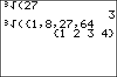

           
|Command Summary|Command Syntax|[Calculator Compatibility](compatibility.html)|[Token Size](tokens.html)|
|--- |--- |--- |--- |
|Take the cube root of a number.|³√(*input*)|TI-83/84/+/SE|1 byte|

### Menu Location
While editing a program, press:<br># MATH to open the [math](math.html) menu<br># 4 or use the arrow keys to select.
# The ³√( Command

Takes the cube root of a positive or negative number.  It works exactly the same as 3<sup>×</sup>√ or ^(1/3) but is smaller and uses an ending parenthesis.  If used on a list, it will return a list with the cube root of each element.
```
³√(8)
		2
³√(2)
		1.25992105
		
³√({1,‾8,27})
		{1 ‾2 3}
```

For complex numbers, the [principal cube root](http://mathworld.wolfram.com/cuberoot.html) is returned, which may be different from the cube root you'd get for the same real number:

```
³√(-8)
		-2
³√(-8+0i)
		1+1.732050808i
```

## Optimization

Never raise something to the one-third power explicitly; use this command instead.

```
:X^(1/3)→X
can be
:³√(X→X
```

## Related Commands

- [^](power.html)
- [×√](xroot.html)
- [√(](square-root.html)
