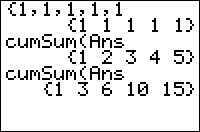

           
|Command Summary|Command Syntax|[Calculator Compatibility](compatibility.html)|[Token Size](tokens.html)|
|--- |--- |--- |--- |
|Calculates cumulative sums of a list or of the columns of a matrix.|cumSum(*list or matrix*)|TI-83/84/+/SE|2 bytes|

### Menu Location
Press:<br># 2nd LIST to access the list menu.<br># RIGHT to access the OPS submenu.<br># 6 to select cumSum(, or use arrows.<br><br>Alternatively, press:<br># MATRIX (TI-83) or 2nd MATRIX (TI-83+ or higher) to access the matrix menu.<br># RIGHT to access the MATH submenu.<br># 0 to select cumSum(, or use arrows.
# The cumSum( Command

`cumSum(` calculates the cumulative sums of a list, or of the columns of a matrix, and outputs them in a new list or matrix variable.

For a list, this means that the Nth element of the result is the sum of the first N elements of the list:
```
cumSum({1,3,5,7,9})
	{1 4 9 16 25}
```

For a matrix, `cumSum(` is applied to each column in the same way as it would be for a list (but numbers in different columns are never added):
```
[[0,1,1][0,1,3][0,1,5][0,1,7]]
	[[0 1 1]
	 [0 1 3]
	 [0 1 5]
	 [0 1 7]]
cumSum(Ans)
	[[0 1 1]
	 [0 2 4]
	 [0 3 9]
	 [0 4 16]]
```

## Advanced Uses

The [`ΔList(`](deltalist.html) command is very nearly the inverse of the cumSum( command - it calculates the differences between consecutive elements. For any list, `ΔList(cumSum(*list*))` will return the same list, but without its first element:
```
ΔList(cumSum({1,2,3,4,5,6,7}))
	{2 3 4 5 6 7}
```

Removing the first element would otherwise be a difficult procedure involving the [`seq(`](seq-list.html) command, so this is a useful trick to know.

------

For a matrix, if you want to sum up the rows instead of the columns, use the `<sup>T</sup>` ([`transpose`](transpose.html)) command.

## Related Commands

- [`ΔList(`](deltalist.html)
- `<sup>T</sup>` ([`transpose`](transpose.html))
