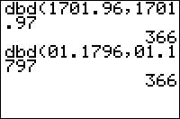

           
|Command Summary|Command Syntax|[Calculator Compatibility](compatibility.html)|[Token Size](tokens.html)|
|--- |--- |--- |--- |
|Calculates the number of days between two days.|dbd(*date1*, *date2*)<br><br>Date format — one of:<br>* DDMM.YY<br>* MM.DDYY|TI-83/84/+/SE|2 bytes|

### Menu Location
On the TI-83, press:
1. 2nd FINANCE to access the finance menu.
2. ALPHA D to select dbd(, or use arrows and ENTER.

On the TI-83+ or higher, press:
1. APPS to access the applications menu.
2. ENTER to select Finance...
3. ALPHA D to select dbd(, or use arrows and ENTER.
       
# The dbd( Command

The `dbd(` command calculates the number of days between two dates. Each date is encoded as a single number in one of two formats (two formats can be mixed in the same command):
- day, month, year — DDMM.YY (e.g. April 26, 1989 would be 2604.89)
- month, day, year — MM.DDYY (e.g. April 26, 1989 would be 04.2689 or just 4.2689)

Because this is just a number like any other, leading zeroes and trailing zeroes after the decimal can be dropped. For example, January 1, 2000 does not have to be formatted as 0101.00 but can be simply 101.

Since there are only two digits for the year, obviously only a century's worth of dates can be handled. The calculator assumes this range to be from January 1, 1950 to December 31, 2049.

If the second date comes before the first, `dbd(` will return a negative number of days, so the range of possible results is from -36524 to 36524.

Finally, `dbd(` will also work for list inputs in the usual manner: a single date will be compared against every date in a list, and two lists of dates will be paired up.

```
dbd(612.07,2512.07
	19
dbd(1.0207,1.0107
	-1
dbd(1.0107,{2.0107,3.0107,4.0107})
	{31 59 90}
```

## Advanced Uses

The `dbd(` command can be used to calculate the [day of week](day-of-week.html) without using the [`dayOfWk(`](dayofwk.html) command, which is only available on the TI-84+ or higher.

## Error Conditions

- **[ERR:DOMAIN](errors.html#domain)** is thrown if a date is improperly formatted.

## Related Commands

- [`dayOfWk(`](dayofwk.html)

## See Also

- [Day of Week](day-of-week.html)
