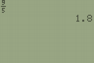

           
|Command Summary|Command Syntax|[Calculator Compatibility](compatibility.html)|[Token Size](tokens.html)|
|--- |--- |--- |--- |
|Mode command that sets Answers to DEC.|DEC Answer|TI-84 2.53MP only|2 bytes|

### Menu Location
Press:
1. MODE
1. DOWN until you see Answers
1. ENTER on DEC

Alternatively, access the catalog.
       
# The DEC Answer Command

The `DEC Answer` command is a mode command that changes the Answers mode to DEC.  DEC mode is very similar to the AUTO mode in which the calculator will display all answers in decimal form unless the returned number is an integer.  Fractions will only be displayed with use of the [`►Frac`](-frac.html) command.

## Related Commands

- [`AUTO Answer`](auto-answer.html)
- [`FRAC Answer`](frac-answer.html)
