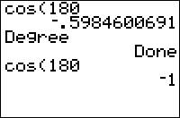

           
|Command Summary|Command Syntax|[Calculator Compatibility](compatibility.html)|[Token Size](tokens.html)|
|--- |--- |--- |--- |
|Puts the calculator in Degree mode.|Degree|TI-83/84/+/SE|1 byte|

### Menu Location
While editing a program, press:<br># MODE to access the mode menu.<br># Use arrows and ENTER to select Degree.
# The Degree Command

The `Degree` command puts the calculator into Degree mode, where the inputs and/or outputs to trig functions are assumed to be degree angles.

Angles measured in degrees range from 0 to 360, with 0 being an empty angle, 90 being a right angle, 180 being a straight angle, and 360 being a full angle all the way around a circle.

To convert from a radian angle to a degree angle, multiply by 180/π. To go the other way, and get a radian angle from a degree angle, multiply by π/180.

The following commands are affected by whether the calculator is in [`Radian`](radian-mode.html) or `Degree` mode:

The input is differently interpreted:
- [`P►Rx(`](p-rx.html), [`P►Ry(`](p-ry.html)
- [`sin(`](sin.html), [`cos(`](cos.html), [`tan(`](tan.html)

The output is differently expressed:
- [`angle(`](angle.html)
- [`R►Pθ(`](r-ptheta.html)
- [`sin‾¹(`](arcsin.html), [`cos‾¹(`](arccos.html), [`tan‾¹(`](arctan.html)
- [`►Polar`](polar-display.html) (and complex numbers when in [`re^θi`](re-thetai.html) mode)
- `<sup>[r](radian-symbol.html)</sup>`, [`°`](degree-symbol.html)

However, some commands are notably unaffected by angle mode, even though they involve angles, and this may cause confusion. This happens with the [`SinReg`](sinreg.html) command, which assumes that the calculator is in `Radian` mode even when it's not. As a result, the regression model it generates will graph incorrectly in `Degree` mode.

Also, complex numbers in polar form are an endless source of confusion. The `angle(` command, as well as the polar display format, are affected by angle mode. However, complex exponentials (see the [`e^(`](e-exponent.html) command), defined as $e^{i\theta}=\cos\theta+i\sin\theta$, are evaluated as though in Radian mode, regardless of the angle mode. This gives mysterious results like the following:
```
Degree:re^θi
		Done
e^(πi)
		1e^(180i)
Ans=e^(180i)
		0 (false)
```

Overall, it's better to put your calculator in `Radian` mode when dealing with polar form of complex numbers, especially since no mathematician would ever use degrees for the purpose anyway.

## Optimization

It's sometimes beneficial to use the [`°`](degree-symbol.html) symbol instead of switching to `Degree` mode. The ° symbol will make sure a number is interpreted as a degree angle, even in `Radian` mode, so that, for example:

```
Radian
		Done
sin(90)
		-.8011526357
sin(90°)
		1
```

This is smaller when only one trig calculation needs to be done. Also, it doesn't change the user's settings, which are good to preserve whenever possible.

## Related Commands

- [`Radian`](radian-mode.html)
- `<sup>[r](radian-symbol.html)</sup>`
- [`°`](degree-symbol.html)
