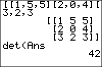

           
|Command Summary|Command Syntax|[Calculator Compatibility](compatibility.html)|[Token Size](tokens.html)|
|--- |--- |--- |--- |
|Calculates the determinant of a square matrix.|det(*matrix*)|TI-83/84/+/SE|1 byte|

### Menu Location
Press:
1. MATRX (83) or 2nd MATRX (83+ or higher) to access the matrix menu
2. LEFT to access the MATH submenu
3. ENTER to select det(.
       
# The det( Command

The `det(` command calculates the [determinant](http://mathworld.wolfram.com/determinant.html) of a square matrix. If its argument is not a square matrix, [ERR:INVALID DIM](errors.html#invaliddim) will be thrown.

## Advanced Uses

If [A] is an N×N matrix, then the roots of det([A]-X identity(N)) are the [eigenvalues](http://mathworld.wolfram.com/eigenvalue.html) of [A].

## Formulas

For 2×2 matrices, the determinant is simply

$$\det\left( \begin{bmatrix} a & b\\c & d \end{bmatrix} \right) = \begin{vmatrix} a & b\\c & d \end{vmatrix} = ad-bc$$

For larger matrices, the determinant can be computed using the [Laplace expansion](https://en.wikipedia.org/wiki/laplace_expansion), which allows you to express the determinant of an n×n matrix in terms of the determinants of (n-1)×(n-1) matrices. However, since the Laplace expansion takes $O\left( n! \right)$ operations, the method usually used in calculators is [Gaussian elimination](http://mathworld.wolfram.com/gaussianelimination.html), which only needs $O\left( n^3 \right)$ operations.

The matrix is first decomposed into a unit lower-triangular matrix and an upper-triangular matrix using elementary row operations:

$$\begin{pmatrix}{1}&{}&{}\\ {\vdots}&{\ddots}&{}\\ {\times}&{\cdots}&{1}\end{pmatrix}
\begin{pmatrix}{\times}&{\cdots}&{\times}\\ {}&{\ddots}&{\vdots}\\ {}&{}&{\times}\end{pmatrix}$$

The determinant is then calculated as the product of the diagonal elements of the upper-triangular matrix.

## Error Conditions

- **[ERR:INVALID DIM](errors.html#invaliddim)** is thrown when the matrix is not square.

## Related Commands

- [`identity(`](identity.html)
- [`ref(`](ref.html)
- [`rref(`](rref.html)
