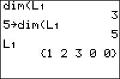

           
|Command Summary|Command Syntax|[Calculator Compatibility](compatibility.html)|[Token Size](tokens.html)|
|--- |--- |--- |--- |
|Returns the size of a list or matrix. Can also be used to change the size.|dim(*list*<br><br>dim(*matrix*<br><br>*length*→dim(*list*<br><br>{*rows*,*columns*→dim(*matrix*|TI-83/84/+/SE|1 byte|

### Menu Location
Press:<br># 2nd LIST to access the list menu<br># RIGHT to access the OPS submenu<br># 3 to choose dim(, or use arrows<br><br>Alternatively, press:<br># MATRIX (83) or 2nd MATRIX (83+ or higher) to access the matrix menu<br># RIGHT to access the MATH submenu<br># 3 to choose dim(, or use arrows
# The dim( Command

The `dim(` command is used to find the size of an existing list or matrix. It takes only one argument - the list or matrix you want the size of. For a list, it returns the number of elements; for a matrix, it returns a two-element list of the number of rows and the number of columns.
```
:dim(L1
	5
:dim([A]
	{2,3}
```

The `dim(` command can also be used to change the size of a list or matrix; this is perhaps its most important use. To do this, just store the desired size to the list or matrix (the `dim(` command is the only one you can store in as though it were a variable).
```
:7→dim(L1
:{2,2→dim([A]
```

For a list, if this increases the size, zero elements will be added to the end of the list; if this decreases the size, elements will be removed starting from the end.

For a matrix, if this increases the number of rows or columns, new rows or columns filled with zeros will be added to the bottom and right respectively. If this decreases the number of rows and columns, those rows and columns will be removed starting from the bottom (for rows) and right (for columns).

If a list or matrix doesn't exist before its size is changed, the `dim(` command will actually create it with the correct size. All the elements, in this case, will be set to 0.

## Advanced Uses

In the case of lists, the `dim(` command is used in adding an element to the end of a list. Although [`augment(`](augment.html) can be used for the same task, `dim(` is faster - but takes more memory. For example, to add the element 5 to the end of L1:
```
:5→L1(1+dim(L1
```

It's also possible, using the `dim(` command, to set the size of a list to 0. In this case, the list exists, but doesn't take up any memory, and cannot be used in expressions (similar to the output of [`ClrList`](clrlist.html)). This is not really useful.

## Optimization

When creating a list or matrix using `dim(`, all the elements are preset to 0; this can be used in place of the [`Fill(`](fill.html) command to set a list or matrix to a bunch of zeros in a program. Since we don't usually know for sure that the list or matrix doesn't exist, we must first delete it with [`DelVar`](delvar.html).

```
:{5,5→dim([A]
:Fill(0,[A]
can be
:DelVar [A]{5,5→dim([A]
```

## Error Conditions

- **[ERR:INVALID DIM](errors.html#invaliddim)** is thrown if you try to make a list or matrix bigger than 999 or 99x99 elements respectively, or if you try to create a matrix that isn't 2-dimensional.

## Related Commands

- [`length(`](length.html)
- [`Fill(`](fill.html)
- [`augment(`](augment.html)
