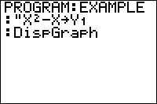

           
|Command Summary|Command Syntax|[Calculator Compatibility](compatibility.html)|[Token Size](tokens.html)|
|--- |--- |--- |--- |
|Displays the graph screen.|DispGraph|TI-83/84/+/SE|1 byte|

### Menu Location
While editing a program, press:
1. PRGM to access the program menu.
2. RIGHT to access the I/O submenu.
3. 4 to select DispGraph, or use arrows and ENTER.
       
# The DispGraph Command

The `DispGraph` command displays the graph screen, along with everything drawn or graphed on it.

In many cases, this doesn't need to be done explicitly: commands from the 2nd DRAW menu, as well as many other graph screen commands, will display the graph screen automatically when they are used. Mainly, it's used for displaying the graphs of equations or plots in a program — you would define the variable in question, then use `DispGraph` to graph it. For example:

```
:"sin(X)"→Y1
:DispGraph
```

## Advanced Uses

`DispGraph` can also be used to update the graph screen, even if it's already being displayed. For example, changing the value of a plot or equation variable doesn't update the graph immediately. Consider this program:

```
:0→I
:"Isin(X)"→Y1
:DispGraph
:For(I,1,10)
:End
```

At first, it graphs the equation Y=Isin(X) with I=0. After this, I is cycled from 1 to 10. However, though the parameter I changes, the graph screen isn't updated, and only the initial graph of Y=0sin(X) and final graph of Y=10sin(X) are displayed. If, on the other hand, we change the program:

```
:0→I
:"Isin(X)"→Y1
:DispGraph
:For(I,1,10)
:DispGraph
:End
```

Now the `DispGraph` inside the loop ensures that the graph screen is updated every time, and the program will correctly display all eleven graphs.

## Error Conditions

- **[ERR:INVALID](errors.html#invalid)** occurs if this statement is used outside a program.

## Related Commands

- [`Disp`](disp.html)
- [`DispTable`](disptable.html)
