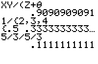

           
|Command Summary|Command Syntax|[Calculator Compatibility](compatibility.html)|[Token Size](tokens.html)|
|--- |--- |--- |--- |
|Returns the division of two numbers.|*value1* / *value2*|TI-83/84/+/SE|1 byte|

### Menu Location
Press [/]
       
# The / Command

The / (divide) operator takes two numbers, variables, or expressions and divides them, thus returning a single new value. The / operator appears higher in the order of operations than both [+](add.html) and [-](subtract.html), so if those appear in an expression, / will be executed first. In addition, the [*](multiply.html) operator has the same order of operations as /, so the calculator simply executes them left to right in the order that they appear.

```
:1/1
           1

:5→X
:2/3X
           3.333333333

:2→A:3→B
:A/B/B/A
           .1111111111
```

## Related Commands

- + ([add](add.html))
- - ([subtract](subtract.html))
- * ([multiply](multiply.html))


## Error Conditions

- **[ERR:DATA TYPE](errors.html#data type)** is thrown if you divide by a matrix.
- **[ERR:DIVIDE BY 0](errors.html#divide by 0)** is thrown if you divide by 0 or a undefined variable.
