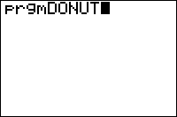

# Donut Quest

|Program Summary|Program Size|Uses Libraries?|Calculator Compatibility|Author|Download|
| --- | --- | --- | --- | --- | --- |
|A quality puzzle game with donuts.|10,276 bytes|No, it's pure TI-Basic|TI-83/84/+/SE|[Mikhail Lavrov](http://mpl.unitedti.org/) (DarkerLine)|[donutquest.zip](http://tibasicdev.github.io/local--files/donut-quest/donutquest.zip)|

A world where the rich hoard donuts in heavily secured mansions, and the poor are left with nothing. A perfect world for a donut thief. Donut Quest is a TI-Basic game of revolutionary quality. It uses no libraries of any kind, in fact, you don't need anything other than the game program to play it. On each of eight levels, you must get to (and eat) all the donuts, then leave through an exit (unless given other instructions). There will be dangerous obstacles ahead of you, and the path will not be easy... but you can always triumph.
