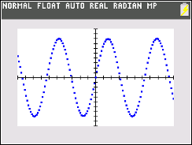

           
|Command Summary|Command Syntax|[Calculator Compatibility](compatibility.html)|[Token Size](tokens.html)|
|--- |--- |--- |--- |
|Sets all lines to be drawn using a series of thick points|This command is executed with no additional arguments|TI-84+CSE/CE|2 bytes|

### Menu Location
Go to Catalog, press [ALPHA][X^-1], and scroll down
       
# The Dot-Thick Command


The `Dot-Thick` command sets all lines in the current function type to be drawn using a series of thick points, about the size of a point drawn using [`Pt-On(`](pt-on.html), at each interval of the `TraceStep`. This command can be called on the homescreen or within a program.

```
:AxesOff
:RectGC
:Dot-Thick
```

## Error Conditions

- **[ERR:SYNTAX](errors.html#syntax)** is thrown if any additional arguments are used with the command

## Related Commands

- [`Dot-Thin`](dot-thin.html)
