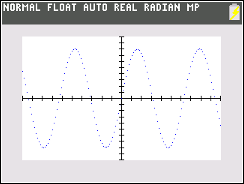

           
|Command Summary|Command Syntax|[Calculator Compatibility](compatibility.html)|[Token Size](tokens.html)|
|--- |--- |--- |--- |
|Sets all lines to be drawn using a series of individual pixels.|This command is executed with no additional arguments|TI-84+CSE/CE|2 bytes|

### Menu Location
Go to Catalog, press [ALPHA][X^-1], and scroll down
       
# The Dot-Thin Command


The `Dot-Thin` command sets all lines in the current function type to be drawn using a series of individual pixels at each interval of `TraceStep`. The command can be called on the homescreen or within a program.

```
:ClrDraw
:AxesOn
:Dot-Thin
```

## Error Conditions

- **[ERR:SYNTAX](errors.html#syntax)** is thrown if the command is executed with any additional arguments

## Related Commands

- [`Dot-Thick`](dot-thick.html)
