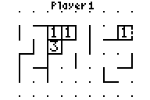

# Dots

|Program Summary|Program Size|Uses Libraries?|Calculator Compatibility|Author|Download|
| --- | --- | --- | --- | --- | --- |
|A quality version of the classic dots game.|1,311 bytes|No, it's pure TI-Basic|TI-83/84/+/SE|[Travis Fischer](http://www.ticalc.org/archives/files/authors/78/7869.html)|[dots.zip](http://tibasicdev.github.io/local--files/dots/dots.zip)|

The classic game of Dots (aka Boxes), popularized by the pencil & paper version, where two or more people take turns connecting a grid of dots with lines in an attempt to form complete boxes. The player who completes the most boxes wins! Features include: 2-9 players, customizable grid width/height, extremely intuitive game controls, and even a preview cursor which shows the user what a line would look like if placed in the current position.
