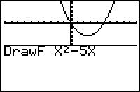

           
|Command Summary|Command Syntax|[Calculator Compatibility](compatibility.html)|[Token Size](tokens.html)|
|--- |--- |--- |--- |
|Draws an expression in terms of X.|DrawF *expression*|TI-83/84/+/SE|1 byte|

### Menu Location
Press:
1. 2nd PRGM to access the draw menu.
1. 6 to select DrawF, or use arrows and ENTER.
       
# The DrawF Command

The `DrawF` commands draws a single expression on the graph screen in terms of X using [`Func`](func.html) graphing mode, regardless of what graphing mode the calculator is actually in. For example, `DrawF X²` will draw a [parabola](https://en.wikipedia.org/wiki/parabola) in the shape of a U on the screen. Of course, how it is displayed all depends on the window dimensions of the graph screen; you should use a [friendly window](friendly-window.html) to ensure it shows up as you intend.

## Advanced Uses

`DrawF` will update X and Y for each coordinate drawn (like [`Tangent(`](tangent.html) and [`DrawInv`](drawinv.html)), and exit with the last coordinate still stored.

When evaluating the expression using `DrawF`, the calculator will ignore the following errors: [ERR:DATA TYPE](errors.html#datatype), [ERR:DIVIDE BY 0](errors.html#divideby0), [ERR:DOMAIN](errors.html#domain), [ERR:INCREMENT](errors.html#increment), [ERR:NONREAL ANS](errors.html#nonrealans), [ERR:OVERFLOW](errors.html#overflow), and [ERR:SINGULAR MAT](errors.html#singularmat). If one of these errors occurs, the data point will be omitted.

For this reason, `DrawF` can sometimes behave in an unexpected fashion: for example, it doesn't throw an error for list or matrix expressions (it won't graph anything, either).

You can use `DrawF` to draw an expression instead of having to store an expression to a Y# variable and then displaying it. At the same time, if you plan on manipulating the expression (either changing the value or changing the expression itself), it would be better to simply use the Y# variable.

## Related Commands

- [`DrawInv`](drawinv.html)
- [`Tangent(`](tangent.html)
