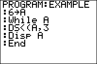

           
|Command Summary|Command Syntax|[Calculator Compatibility](compatibility.html)|[Token Size](tokens.html)|
|--- |--- |--- |--- |
|Decrements a variable by 1 and skips the next command if the variable is less than the value.|DS<(*variable*,*value*)<br>*command*|TI-83/84/+/SE|1 byte|

### Menu Location
While editing a program, press:
1. PRGM to enter the PRGM menu
1. ALPHA APPS (or 'B') to choose DS<(, or use arrows
       
# The DS<( Command

The decrement and skip if less than command — `DS<(` — is a specialized conditional command. It is equivalent to an [`If`](if.html) conditional, except the next command will be skipped when the condition is true and it has a [variable](variables.html) update built-in. However, it is not used very often (if anything, it is often misused as a looping command) because of its obscure name and somewhat limited application.

The `DS<(` command takes two arguments:
- A variable, which is limited only to one of the [real variables](variables.html#toc1) (`A`-`Z` or `θ`).
- A value, which can be any expression which evaluates to a real number.

When `DS<(` is executed it subtracts one from the variable (decrements it by one), and compares it to the value. The next command will be skipped if the variable is less than the value, while the next command will be executed if the variable is greater than or equal to the value.

The command `DS<(A,B` is equivalent to the following code:
```
:A-1→A
:If A≥B
```

Here are the two main cases where the `DS<(` command is used:

```
:5→A
:DS<(A,6
:Disp "Skipped
```

- Initializes `A` to 5 and then compares to the value
- 5<6 is true so the display message won't be displayed

```
:3→B
:DS<(B,2
:Disp "Not Skipped
```

- Initializes `B` to 3 and then compares to the value
- 3<2 is false so the display message will be displayed

Note: In addition to both of these cases, there is also the case where the variable and the value are equal to each other. This case is shown below under the 'Advanced Uses' section because it has some added background that goes with it.

## Advanced Uses

When you want the skipping feature of the `DS<(` command to always occur, you just have to use the same variable for both the variable and value arguments of the command:

```
:DS<(B,B
```

An undefined error will occur if the variable and/or value doesn't exist before the `DS<(` command is used, which happens when the [`DelVar`](delvar.html) command is used. Consequently, you should not use `DelVar` with `DS<(`.

A similar code can be used as a substitute for `B-1→B` if you don't want to change [`Ans`](ans.html):
```
:DS<(B,B:
```
Note that due to the colon after the line, there will be no statement skipped, so you don't have to worry about that.

## Optimization

If a program needs to decrement a positive variable, `DS<(` is one byte smaller than than decrementing a variable normally.

```
:A-1→A
can be
:DS<(A,0
```

The one caution about this is that if the variable is less than the value (in this case, '0'), the next command will be skipped. If you don't want the skipping functionality, then it is necessary to make sure that the value is never greater than the variable. Also, `DS<(` is slower than its more often used counterpart.

Related to the example code given, `DS<(` should always have a command following after it (i.e. it's not the last command in a program) because it will return an error otherwise. If you have no particular code choice, an empty line will suffice.

```
code that will run
:DS<(A,0
:
more code that will run
```

## Command Timings

Using `DS<(` to decrement a variable is approximately 25% slower than using code like `X-1→X`. However, it is faster to use `DS<(` than to construct an `If` statement to do the same thing.

Note, however, that a quirk in the [`For(`](for.html) command (see its [Optimization](for.html#optimization) section) will slow down the `DS<(` command significantly if a closing parenthesis is not used for the `For(` statement.

## Error Conditions

- **[ERR:INVALID](errors.html#invalid)** occurs if this statement is used outside a program.
- **[ERR:SYNTAX](errors.html#syntax)** is thrown if there is no next line to skip.
- **[ERR:UNDEFINED](errors.html#undefined)** is thrown if the variable to be decremented is not defined.

## Related Commands

- [`IS>(`](is.html)
- [`If`](if.html)
